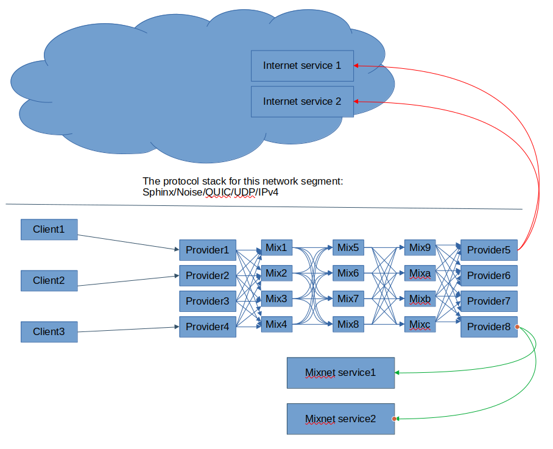
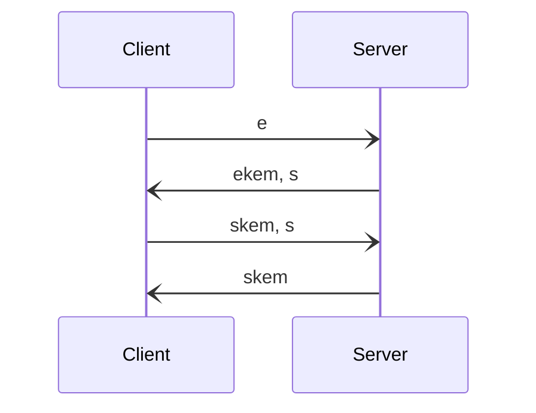

# Katzenpost Mix Network

## Post Quantum Anonymous Communication Network


We are all under more surveillance today than nearly all of human history.

Katzenpost software project would like to help people communicate more freely. There are many types of surveillance today and Katzenpost is designed to help with a type of surveillance known as traffic analysis. Traffic analysis typically refers to the statistical analysis of encrypted traffic. Much information can be gleaned by analyzing encrypted traffic because our network protocols leak lots of information such as source and destination IP addresses, message size, message sequence, message delay pattern, geographical locations, social graph etc.

Katzenpost is a software project dedicated to designing and implementing
mix network protocols. A mix network is a type of anonymous communication network.
What is an anonymous communication network? It's a traffic analysis resistant network; that is, it's protocols are designed to resist statistical analysis by passive global adversaries. We also have some defenses against active adversaries as well.

We build anonymous protocols so that everyone can communicate more freely
in this age of pervasive surveillance.

Our network model has three layers:

1. Post Quantum Hybrid Noise cryptographic protocol
that routes messages over the Internet. Can use either TCP or QUIC.

2. Post Quantum Hybrid NIKE/KEM Sphinx cryptographic packet protocol layer
   which mixes, routes and cryptographically transforms Sphinx packets at each hop.

3. Post Quantum Hybrid cryptographic application protocol layer, for example,
   our double ratchet that uses a hybrid NIKE with [CTIDH](https://ctidh.isogeny.org/) and X25519.


# Project Status

**A status update is forthcoming!**




# Easy One Step BUILD

All you have to do is type:

```bash
make
```

For Docker users, you can use:

```bash
make docker
```

This builds 3 binaries:

* mix server
* dirauth server
* mixnet ping CLI command


# Usage And Configuration

Our docker configuration is the most comprehensive and up to date place to learn about how to configure a Katzenpost mix network. Run the makefile in the docker directory to get a usage menu:

```bash
$ cd katzenpost/docker; make 
These make targets allow you to control the test network:
 run                - run the testnet in the foreground, until ctrl-C
 start              - start the testnet in the background
 stop               - stop the testnet
 wait               - wait for testnet to have consensus
 watch              - tail -F all logs
 status             - show testnet consensus status
 show-latest-vote   - does what it says
 run-ping           - send a ping over the testnet
 clean-local        - stop, and delete data and binaries
 clean-local-dryrun - show what clean-local would delete
 clean              - the above, plus cleans includes go_deps images
```

**You can run a docker mixnet locally and then inspect the configuration files
to learn how to configure a Katzenpost mixnet.**


Documentation is a work in progress:

* [mix server docs](docs/handbook/mix_server.rst)

* [dirauth server docs](docs/handbook/voting_pki.rst)


# Expert's Corner

Katzenpost is an unverified decryption mix network that uses a continuous time
mixing strategy with client selected exponential delays and a stratified (layered) topology. 

Our documentation is in progress, but we have some resources for experts:

* Our threat model document, work-in-progress, can be found [here.](https://raw.githubusercontent.com/katzenpost/katzenpost/add_threat_model_doc/docs/specs/threat_model.rst)

* Our design specification documents are available [here.](https://github.com/katzenpost/katzenpost/tree/main/docs/specs)

## Wire protocol based on Noise

Our "wire" protocol, the protocol that sits on top of either TCP or QUIC,
is a cryptographic protocol based on Noise:

[The Noise Protocol Framework](https://noiseprotocol.org/)

We believe in the Noise cryptographic protocol framework, that it is good to use it instead of TLS, whenever possible. Noise places all of the protocol decision making during the design phase of the protocol instead of during protocol runtime. This means there are no protocol downgrade attacks, no dynamic selection of ciphersuite and so on.

However, we use a variation of Noise called [Post Quantum Noise](https://eprint.iacr.org/2022/539.pdf), from the paper:

```
@misc{cryptoeprint:2022/539,
      author = {Yawning Angel and Benjamin Dowling and Andreas Hülsing and Peter Schwabe and Florian Weber},
      title = {Post Quantum Noise},
      howpublished = {Cryptology ePrint Archive, Paper 2022/539},
      year = {2022},
      doi = {10.1145/3548606.3560577},
      note = {\url{https://eprint.iacr.org/2022/539}},
      url = {https://eprint.iacr.org/2022/539}
}
```

The precise Noise protocol descriptor string we use is:

``Noise_pqXX_Kyber768X25519_ChaChaPoly_BLAKE2s``

However the hybrid KEM Kyber768X25519 is constructed using a security preserving KEM combiner and a NIKE to KEM adapter with semantic security so that the resulting hybrid KEM is IND-CCA2 in QROM.

Here's a diagram of the pqXX pattern which we use:



## Sphinx

We use the Sphinx cryptographic packet format and allow it's geometry to be completely configurable to accomodate various networking requirements. Additionally the Sphinx can use any NIKE (non-interactive key exchange). We also developed a novel post quantum variation called KEM Sphinx. KEM (key encapsulation mechanism) Sphinx is twice as fast on the server side as the original NIKE Sphinx because it only requires one public key operation per hop instead of two. However it has the packet header overhead size penalty that grows linearly with the number of hops.

Mix network key management and distribution is handled by the directory authority system, a decentralized voting protocol that can tolerate (1/2 * n)-1 node outages.


# Donations

Your donations are welcomed and can be made through Open Collective [here.](https://opencollective.com/the-katzenpost-software-project)


# Supported By

This project has received funding from:

* European Union’s Horizon 2020 research and innovation programme under the Grant Agreement No 653497, Privacy and Accountability in Networks via Optimized Randomized Mix-nets (Panoramix).


* The Samsung Next Stack Zero grant
* NLnet and the NGI0 PET Fund paid for by the European Commission


