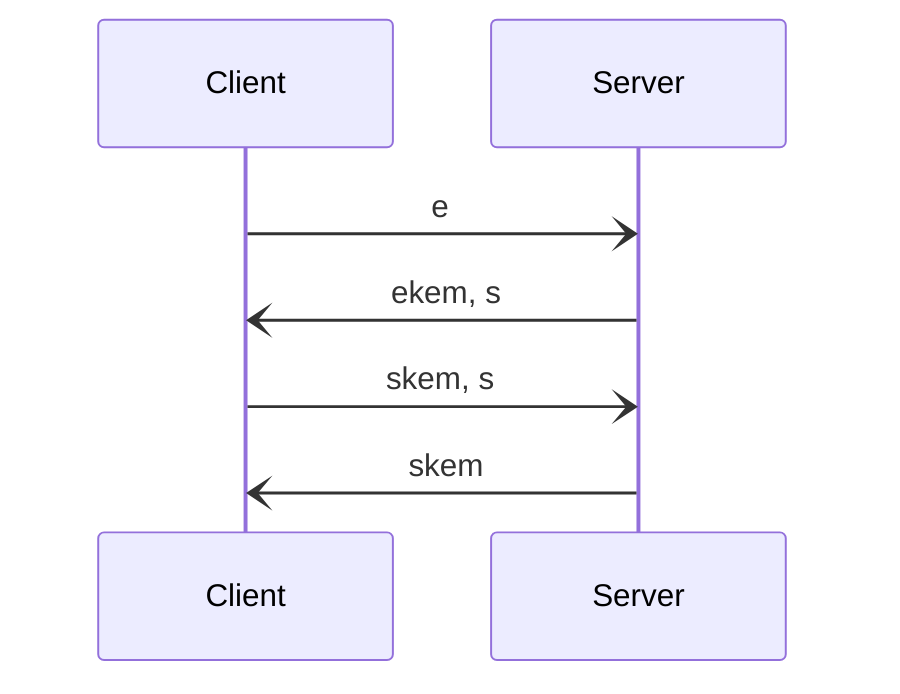

# Katzenpost Mix Network

## Post Quantum Anonymous Communication Network


Katzenpost is a software project dedicated to designing and
implementing mix network protocols. A mix network is a type of
anonymous communication network. An anonymous communication
network is also known as a traffic analysis resistant network; that is,
it's protocols are designed to resist statistical analysis by passive
global adversaries.

Traffic analysis typically refers to the statistical analysis of
encrypted traffic. Traffic analysis is worth defending against given
that common network protocols leak lots of information such as source
and destination IP addresses, message size, message sequence, message
delay pattern, geographical locations, social graph etc. Mere end to
end encryption alone cannot protect against this type of information
leakage.

At the most basic level, mixnets are composed of mix nodes. These are
a cryptographic packet switching routers which protect our privacy by
mixing many messages together and cryptographically transforming them
before routing them on to the next hop. Mix nodes also use shuffling
or added latency to create uncertainty for network observers. This
uncertainty is in regards to trying to link incoming messages with the
outgoing messages.


# Project Status

We are currently working to implement the new mixnet protocols discussed
in our [paper](https://arxiv.org/abs/2501.02933). Please also see the
specification documents for the new protocols:

[Pigeonhole Protocol Specification](https://katzenpost.network/docs/specs/pigeonhole/)
[Group Chat Protocol Specification](https://katzenpost.network/docs/specs/group_chat.html)

Within this repo there are some old deprecated APIs which are associated with the "old client":

* client
* minclient
* stream
* map
* cmd/http-proxy-client
* cmd/http-proxy-server
* cmd/katzencat
* cmd/katzencopy
* cmd/map

**PLEASE TAKE CARE TO AVOID USING THESE DEPRECATED SECTIONS OF OUR CODEBASE!**


# Building Katzenpost

## Build Targets

The root Makefile provides several build targets for different components:

### Standard Components
To build all standard server and client components (excluding replica), use:

```bash
cd katzenpost
make all
```

This builds all executables in the `cmd/` directory:
- **server** - Mix server node
- **dirauth** - Directory authority node
- **genconfig** - Configuration file generator
- **ping** - Network connectivity testing tool
- **courier** - Message courier service
- **echo-plugin** - Echo service plugin
- **fetch** - Data fetching utility
- **genkeypair** - Cryptographic key pair generator
- **gensphinx** - Sphinx packet generator
- **http-proxy-client** - HTTP proxy client
- **http-proxy-server** - HTTP proxy server
- **katzencat** - Katzenpost netcat-like utility
- **katzencopy** - File transfer utility
- **kpclientd** - Katzenpost client daemon
- **map** - Network mapping utility
- **sphinx** - Sphinx cryptographic packet tool

### Individual Components
You can also build individual components:

```bash
make server      # Build just the mix server
make dirauth     # Build just the directory authority
make genconfig   # Build just the config generator
# ... etc for any component
```

### Replica Component (Special Requirements)

**⚠️ The replica component requires RocksDB and cannot be built with standard `go build` commands.**

RocksDB is a C++ library that must be compiled and installed system-wide before building the replica. Due to CGO linking requirements, the replica build requires specific compiler flags and environment variables. This is why we provide dedicated Makefile targets:

```bash
make install-replica-deps  # Install RocksDB and dependencies (requires sudo)
make replica               # Build the replica executable
make test-replica          # Run replica unit tests
make bench-replica         # Run replica benchmarks
```

The `make replica` target will automatically run `install-replica-deps` if RocksDB is not found.

**Note:** These targets require sudo privileges to install system dependencies and take several minutes to compile RocksDB from source.

### Cleaning Built Binaries
To remove all built executables:

```bash
make clean
```

## Dependencies

### Standard Components
Most Katzenpost components require Go and basic build tools.

**Debian/Ubuntu users** should first install build essentials:
```bash
sudo apt-get update
sudo apt-get install -y build-essential
```

### Replica Component Dependencies

**⚠️ Do not attempt to build the replica with `go build` - it will fail.**

The replica requires RocksDB, a C++ embedded database. Building RocksDB from source takes several minutes and requires:

- **Compiler**: GCC 14 (gcc-14, g++-14)
- **Build tools**: cmake, pkg-config
- **Libraries**: libsnappy-dev, libzstd-dev, liblz4-dev, zlib1g-dev, libbz2-dev, liburing-dev, libgflags-dev
- **RocksDB v10.2.1**: Compiled from source with `make shared_lib`

Use the Makefile targets described above - they handle all of this automatically.

# Client:

New Katzenpost mixnet clients are forthcoming.


# Server Side Usage/Configuration

Our docker configuration is the most comprehensive and up to date
place to learn about how to configure a Katzenpost mix network. Run
the makefile in the docker directory to get a usage menu:

```bash
$ cd katzenpost/docker; make 
These make targets allow you to control the test network:
 config-only        - generate configuration files only (no docker containers)
 start              - start the testnet
 stop               - stop the testnet
 client-restart     - restart just the kpclientd daemon
 client-logs        - view kpclientd daemon logs
 wait               - wait for testnet to have consensus
 watch              - tail -F all logs
 watch-replicas     - monitor all replica logs
 watch-auth         - monitor all directory authority logs
 watch-mixes        - monitor all mix node logs
 watch-courier      - monitor courier service log
 watch-servicenode  - monitor service node log
 watch-gateway      - monitor gateway log
 watch-all-separate - monitor all logs with component labels
 status             - show testnet consensus status
 show-latest-vote   - does what it says
 run-ping           - send a ping over the testnet
 clean-bin          - stop, and delete compiled binaries
 clean-local        - stop, and delete data and binaries
 clean-local-dryrun - show what clean-local would delete
 clean              - the above, plus cleans includes go_deps images
```

**You can run a docker mixnet locally and then inspect the configuration files
to learn how to configure a Katzenpost mixnet.**


Documentation is a work in progress:

* [Katzenpost Mixnet Documentation](https://katzenpost.network/docs/)

* [Using the Katzenpost Docker test mix network](https://katzenpost.network/docs/admin_guide/docker.html)

* [Mixnet Admin guide](https://katzenpost.network/docs/admin_guide/)


# Expert's Corner

Katzenpost is an unverified decryption mix network that uses a continuous time
mixing strategy with client selected exponential delays and a stratified routing topology. 

We have some resources for experts:

* [Mixnet Threat Model Document](https://katzenpost.network/research/Threat_Model_Doc.pdf)

* [Mixnet Literature Review](https://katzenpost.network/research/Literature_overview__website_version.pdf)


## Cryptographic Agility

Katzenpost consists of 3 core cryptographic protocols all of which have cryptographic agility
with respect to the KEM, NIKE or signature scheme being used:

1. Wire protocol based on Noise/PQ Noise
2. Sphinx
3. PKI

Each of these protocols makes use of our golang cryptography library called HPQC (hybrid post quantum cryptography):

https://github.com/katzenpost/hpqc

Firstly, for each of the protocols we make use of a small set of
golang interfaces for KEM, NIKE and signature schemes respectively
allowing us to build protocols that are completely agnostic to the
specific cryptographic primitive being used.  Secondly, each of these
protocol implementations allows for the selection of the cryptographic
primitive via it's TOML configuration file.

Here's what primitives are available to you:

| NIKE: Non-Interactive Key Exchange |
|:---:|

| Primitive | HPQC name | security |
|  --------  |  -------  | -------  | 
| Classical Diffie-Hellman | "DH4096_RFC3526" | classic |
| X25519 | "X25519" | classic |
| X448 | "X448" | classic |
| Implementations of CTIDH | "ctidh511", "ctidh512", "ctidh1024", "ctidh2048" | post-quantum | 
| hybrid of CSIDH and X25519 | "NOBS_CSIDH-X25519 " | hybrid |
|hybrids of CTIDH with X25519 | "CTIDH511-X25519", "CTIDH512-X25519", "CTIDH1024-X25519" | hybrid |
| hybrids of CTIDH with X448 | "CTIDH512-X448", "CTIDH1024-X448", "CTIDH2048-X448"| hybrid |

__________

| KEM: Key Encapsulation Mechanism |
|:---:|


| Primitive | HPQC name | security |
|  --------  |  -------  | -------  | 
| ML-KEM-768| "MLKEM768" | post-quantum |
| XWING is a hybrid primitive that pre-combines ML-KEM-768 and X25519. Due to [security properties](https://eprint.iacr.org/2018/024) of our combiner, we also implement our own combination of the two below.| "XWING" | hybrid |
| The sntrup4591761 version of the NTRU cryptosystem. | "NTRUPrime"  | post-quantum |
| FrodoKEM-640-SHAKE |"FrodoKEM-640-SHAKE"| post-quantum|
| Various forms of the McEliece cryptosystem| "mceliece348864", "mceliece348864f", "mceliece460896", "mceliece460896f", "mceliece6688128", "mceliece6688128f", "mceliece6960119", "mceliece6960119f", "mceliece8192128", "mceliece8192128f" | post-quantum|
|A hybrid of ML-KEM-768 and X25519. The [KEM Combiners paper](https://eprint.iacr.org/2018/024.pdf) is the reason we implemented our own combination in addition to including XWING. |"MLKEM768-X25519"| hybrid |
|A hybrid of ML-KEM-768 and X448|"MLKEM768-X448"| hybrid |
|A hybrid of FrodoKEM-640-SHAKE and X448|"FrodoKEM-640-SHAKE-X448"| hybrid |
|A hybrid of NTRU and X448| "sntrup4591761-X448"| hybrid |
|Hybrids of the McEliece primitives and X25519| "mceliece348864-X25519", "mceliece348864f-X25519", "mceliece460896-X25519", "mceliece460896f-X25519", "mceliece6688128-X25519", "mceliece6688128f-X25519", "mceliece6960119-X25519", "mceliece6960119f-X25519", "mceliece8192128-X25519", "mceliece8192128f-X25519" | hybrid|

As well as all of the NIKE schemes through the KEM adapter, and any combinations of the above through the combiner.

____________

| SIGN: Cryptographic Signature Schemes |
|:---:|


| Primitive | HPQC name | security |
|  --------  |  -------  |  -------  |
| Ed25519 | "ed25519" | classic |
| Ed448 | "ed448" | classic |
| Sphincs+shake-256f | "Sphincs+" | post-quantum |
| hybrids of Sphincs+ and ECC | "Ed25519 Sphincs+", "Ed448-Sphincs+" | hybrid |
|hybrids of Dilithium 2 and 3 with Ed25519 | "eddilithium2", "eddilithium3" | hybrid |


## Wire protocol based on Noise/PQ Noise

All Katzenpost components communicate with one another using our
"wire" protocol which currently only works on TCP but hopefully soon also QUIC.
This wire protocol is traffic padded as a redundant measure against traffic analysis.

We believe in [The Noise Protocol Framework](https://noiseprotocol.org/), that it is
good to use it instead of TLS, whenever possible. Noise places all of
the protocol decision making during the design phase of the protocol
instead of during protocol runtime. This means there are no protocol
downgrade attacks, no dynamic selection of ciphersuite and so on.

However, we use a variation of Noise called [Post Quantum Noise](https://eprint.iacr.org/2022/539.pdf), from the paper:

```
@misc{cryptoeprint:2022/539,
      author = {Yawning Angel and Benjamin Dowling and Andreas Hülsing and Peter Schwabe and Florian Weber},
      title = {Post Quantum Noise},
      howpublished = {Cryptology ePrint Archive, Paper 2022/539},
      year = {2022},
      doi = {10.1145/3548606.3560577},
      note = {\url{https://eprint.iacr.org/2022/539}},
      url = {https://eprint.iacr.org/2022/539}
}
```

Our wire protocol implementation let's you select any KEM and if you
happened to have selected Xwing then the precise Noise protocol
descriptor string for the protocol would be:

``Noise_pqXX_Xwing_ChaChaPoly_BLAKE2s``

Here's a diagram of the pqXX pattern which we use:



## Sphinx

We use the Sphinx cryptographic packet format and allow it's geometry
to be completely configurable to accomodate various networking
requirements. Additionally the Sphinx can use any NIKE
(non-interactive key exchange). We also developed a novel post quantum
variation called KEM Sphinx. KEM (key encapsulation mechanism) Sphinx
is twice as fast on the server side as the original NIKE Sphinx
because it only requires one public key operation per hop instead of
two. However it has the packet header overhead size penalty that grows
linearly with the number of hops.

And here are some Sphinx benchmarks using different KEMs and NIKEs, computed on David's laptop:

| Primitive | Sphinx type | nanoseconds/op |
| :---      |  :---:      |     ---:       |
| X25519 | NIKE | 144064 |
| X448 | NIKE | 131322 |
| X25519 CTIDH512 | NIKE | 256711856 |
| X25519 | KEM | 55718 |
| Xwing | KEM | 172559 |
| MLKEM768-X25519 | KEM | 173413 |

We can draw several conclusions from this table of benchmarks:

1. KEM Sphinx is about twice as fast as NIKE Sphinx
2. MLKEM768 is faster than X25519
3. Xwing KEM Sphinx is almost as fast as X25519 NIKE
   Sphinx but probably a lot more secure given that it's a post quantum
   hybrid construction which still uses the classically secure X25519
   NIKE.
4. CTIDH is very slow and we probably don't want to use it for
   Sphinx. We instead think it very useful for application level
   encryption.

Please also note that hybrid KEMs referred to above are constructed
using a security preserving KEM combiner and a NIKE to KEM adapter (adhoc elgamal construction)
with semantic security so that the resulting hybrid KEM is IND-CCA2 in the QROM.

## PKI/Directory Authority

Mix network key management and distribution is handled by the
directory authority system, a decentralized voting protocol that can
tolerate (1/2 * n)-1 node outages.  Clients and mix nodes can talk to
the dirauth (directory authority) system to get a published PKI document which is
essentially a view of the network which contains public cryptographic
keys and network connection information.

The mix descriptors are signed by the mix nodes. Each dirauth also signs their
interactions in the voting protocol and the final published PKI document.

Mix nodes and dirauth (directory authority) nodes use whichever signature scheme selected
by the dirauth configuration. Clients also use this signature scheme to verify PKI documents.


# Debugging/Profiling Katzenpost

We can optionally enable the use of pyroscope pprof profiling within the mix server
by building with the "pyroscope" build tag:

cd cmd/server; go build --tags pyroscope

You'll have to setup a pyroscope server via these instructions, here:

https://grafana.com/docs/pyroscope/latest/get-started/

And you can point the mix server at the pyroscope server via environment variables:

```bash
export PYROSCOPE_APPLICATION_NAME=katzenpost_mix_server
export PYROSCOPE_SERVER_ADDRESS=http://localhost:4040
export PYROSCOPE_SERVICE_TAG=mix1
./server -f katzenpost-server.toml
```


# License

AGPLv3

# Donations

Your donations are welcomed and can be made through Open Collective [here.](https://opencollective.com/the-katzenpost-software-project)


# Supported By

[](https://www.ngi.eu/about/)
<a href="https://nlnet.nl"></a>
<a href="https://nlnet.nl/assure"></a>
<a href="https://nlnet.nl/NGI0"></a>

This project has received funding from:

* European Union’s Horizon 2020 research and innovation programme under the Grant Agreement No 653497, Privacy and Accountability in Networks via Optimized Randomized Mix-nets (Panoramix).
* The Samsung Next Stack Zero grant.
* NGI0 PET Fund, a fund established by NLnet with financial support from the European Commission's Next Generation Internet programme, under the aegis of DG Communications Networks, Content and Technology under grant agreement No 825310.
* NGI Assure Fund, a fund established by NLnet with financial support from the European Commission's Next Generation Internet programme, under the aegis of DG Communications Networks, Content and Technology under grant agreement No 957073.

