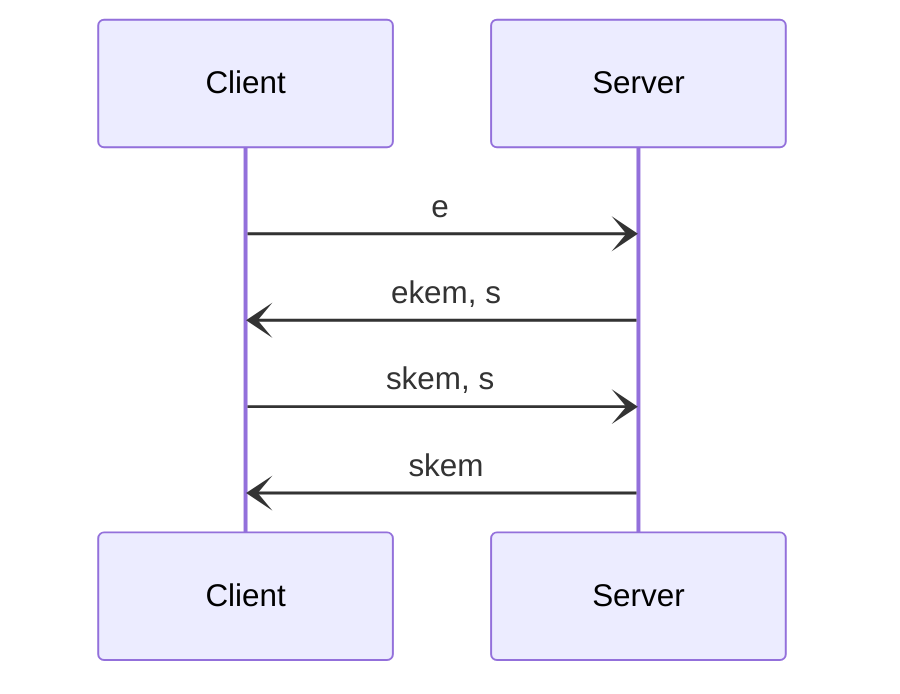

# Katzenpost Mix Network

## Post Quantum Anonymous Communication Network


Katzenpost is a software project dedicated to designing and
implementing mix network protocols. A mix network is a type of
anonymous communication network. An anonymous communication
network is also known as a traffic analysis resistant network; that is,
it's protocols are designed to resist statistical analysis by passive
global adversaries.

Traffic analysis typically refers to the statistical analysis of
encrypted traffic. Traffic analysis is worth defending against given
that common network protocols leak lots of information such as source
and destination IP addresses, message size, message sequence, message
delay pattern, geographical locations, social graph etc. Mere end to
end encryption alone cannot protect against this type of information
leakage.

At the most basic level, mixnets are composed of mix nodes. These are
a cryptographic packet switching routers which protect our privacy by
mixing many messages together and cryptographically transforming them
before routing them on to the next hop. Mix nodes also use shuffling
or added latency to create uncertainty for network observers. This
uncertainty is in regards to trying to link incoming messages with the
outgoing messages.


## Pigeonhole: a storage layer atop the mixnet

Beyond mix routing itself, Katzenpost provides a storage layer called
Pigeonhole. Applications communicate through encrypted, append-only
streams composed of fixed-size, padded Boxes that are sharded across
storage replicas via consistent hashing (two replicas per Box). Access
is governed by cryptographic capabilities: a write capability can
append messages or place tombstones, whilst a separate read capability
decrypts and verifies without conferring any ability to write. Streams
are single-writer and multi-reader, and unlinkable in the sense that
storage servers cannot tell which messages belong to the same stream.
Storage is ephemeral: Boxes are garbage-collected after roughly two
weeks, so Pigeonhole is not intended as long-term archival storage.

Clients never speak to replicas directly. Each Pigeonhole operation
is carried as a Sphinx round-trip through the mix layers to a courier
service, which then forwards the request to the appropriate replicas
on fixed-throughput connections so that traffic patterns reveal
nothing to an outside observer. Many higher-level protocols (group
chat, file transfer, request-response services) compose readily on
top of these streams by sharing read capabilities out-of-band.

For a developer-oriented introduction see
[Understanding Pigeonhole](https://katzenpost.network/docs/pigeonhole_explained/);
for the wire-level details see the
[Pigeonhole specification](https://katzenpost.network/docs/specs/pigeonhole/)
and §§4-5 of the [Echomix paper](https://arxiv.org/abs/2501.02933).


# Project Status

The designs presented in our
[Echomix paper](https://arxiv.org/abs/2501.02933) are now implemented.
The paper offers a broad overview of Katzenpost; for the present
codebase the two sections that map most directly onto the code are §4,
which describes **BACAP** (the blinding-and-capability scheme used to
derive Box identifiers and the read/write capabilities), and §5, which
describes the **Pigeonhole protocol** (couriers, replicas, sharding,
copy commands, and tombstones).

The paper is the high-level treatment; the focused normative
specifications live on the website:

* [Pigeonhole Protocol Specification](https://katzenpost.network/docs/specs/pigeonhole/)
* [Group Chat Protocol Specification](https://katzenpost.network/docs/specs/group_chat/)
* [Thin Client Specification](https://katzenpost.network/docs/specs/thin_client/)

For the messaging client application see the
[Katzenqt repository](https://github.com/katzenpost/katzenqt).


# Architecture

The repository is a Go monorepo. Each top-level directory is either a
library shared between components, a long-lived component (mix server,
dirauth, courier, replica, client daemon), or one of the entry-point
binaries under `cmd/`.

```
katzenpost/
├── cmd/                       # Executable entry points (one per binary)
│   ├── server/                # Mix node (gateway, service, or mix)
│   ├── dirauth/               # Directory authority node
│   ├── kpclientd/             # Client daemon
│   ├── courier/               # Pigeonhole courier service
│   ├── replica/               # Pigeonhole storage replica
│   ├── genconfig/             # TOML configuration generator
│   ├── ping/                  # Round-trip connectivity test
│   ├── fetch/                 # PKI document fetcher
│   ├── sphinx/                # Sphinx packet diagnostic tool
│   ├── geometry/              # Sphinx and Pigeonhole geometry generator
│   ├── genkeypair/            # Key pair generator
│   ├── echo-plugin/           # Echo service plugin (example)
│   ├── http-proxy-client/     # HTTP-over-mixnet proxy client
│   └── http-proxy-server/     # HTTP-over-mixnet proxy server
│
├── core/                      # Primitives shared by every component
│   ├── sphinx/                # Sphinx packet format (NIKE and KEM variants)
│   ├── wire/                  # PQ Noise wire protocol over TCP
│   ├── pki/                   # PKI document types and verification
│   ├── cert/                  # Multi-signature certificate scheme
│   ├── epochtime/             # Epoch arithmetic (the system's heartbeat)
│   ├── genconfig/             # Programmatic config generation library
│   ├── log/                   # Logging facade
│   ├── queue/                 # Priority queues used by the scheduler
│   ├── retry/                 # Retry/backoff helpers
│   ├── thwack/                # Lightweight management protocol
│   ├── utils/                 # Misc utilities (constants, hash helpers)
│   ├── worker/                # Worker goroutine helpers with HaltCh
│   └── compat/                # OS compatibility shims
│
├── authority/                 # Directory authority (voting consensus PKI)
│   └── voting/
│       ├── client/            # PKI client used by mixes and clients
│       └── server/            # Voting protocol server (the dirauth)
│
├── server/                    # Mix node, used as gateway/service/mix
│   ├── config/                # Server TOML schema
│   ├── internal/              # Wire-up of the node's subsystems:
│   │   ├── gateway/           #   gateway-specific behavior
│   │   ├── incoming/          #   inbound wire connections
│   │   ├── outgoing/          #   outbound wire connections
│   │   ├── cryptoworker/      #   Sphinx unwrap workers
│   │   ├── scheduler/         #   per-hop delay scheduler
│   │   ├── decoy/             #   decoy traffic generator
│   │   ├── mixkey/            #   per-epoch mix keys (memory-only)
│   │   ├── pki/               #   PKI fetch loop
│   │   └── service/kaetzchen/ #   service node plugin host
│   ├── cborplugin/            # CBOR-over-stdio plugin protocol
│   └── spool/                 # Gateway message spool storage
│
├── client/                    # Client daemon and thin client API
│   ├── thin/                  # Thin-client API (Go reference; Rust and Python live in thin_client repo)
│   ├── config/                # Client TOML schema
│   ├── transport/             # Daemon to gateway transport
│   ├── arq.go, daemon.go, …   # ARQ resend, connection state, dispatch
│   └── pigeonhole.go          # Pigeonhole channel logic in the daemon
│
├── courier/                   # Pigeonhole courier service plugin
│   └── server/                # Plugin host, replica fan-out, copy state
│
├── replica/                   # Pigeonhole storage replica (RocksDB)
│   ├── common/                # Shared types (envelope keys, sharding)
│   ├── config/                # Replica TOML schema
│   ├── handlers.go            # Read/write/proxy/replication handlers
│   ├── envelope_epoch.go      # Envelope key rotation window
│   ├── pkiworker.go           # PKI fetch loop
│   ├── integration_tests/     # Courier <-> replica end-to-end tests
│   └── cryptography_model_tests/  # Crypto model tests
│
├── pigeonhole/                # Pigeonhole protocol layer (shared)
│   ├── pigeonhole_messages.trunnel  # Wire schema (regenerate via go generate)
│   ├── trunnel_messages.go    # Generated; do not hand-edit
│   ├── geo/                   # Pigeonhole packet geometry
│   ├── copy_stream.go         # Streaming all-or-nothing copy state
│   └── errors.go              # Pigeonhole-level error codes
│
├── common/                    # Cross-component helpers (CLI, PEM, lambda)
├── loops/                     # Decoy-loop packet-loss heat map types
├── quic/                      # Optional QUIC transport (in progress)
├── tools/                     # Operator scripts (e.g. mixnet-params.py)
└── docker/                    # Local docker mixnet for development
    ├── Makefile               # start/stop/watch targets
    └── voting_mixnet/         # Generated configs and binaries
```

For the Pigeonhole storage system specifically, the courier and
replica together implement the design described in §5 of the
[Echomix paper](https://arxiv.org/abs/2501.02933); the BACAP scheme
they rely on lives in the [hpqc repository](https://github.com/katzenpost/hpqc)
under `bacap/`.


# Building Katzenpost

For a guided walk-through with pinned versions of every component
(katzenpost, hpqc, thin_client, katzenqt) see the
[Build from source](https://katzenpost.network/docs/build_from_source/)
page on the website. The instructions below cover the in-tree
Makefile targets.

## Build Targets

The root Makefile provides several build targets for different components:

### Standard Components

Most Katzenpost components require Go and basic build tools.
To build all standard server and client components (excluding replica), use:

**Debian/Ubuntu users** should first install build essentials:
```bash
sudo apt-get update
sudo apt-get install -y build-essential
```

and then build:
```bash
cd katzenpost
make all
```

This builds all executables in the `cmd/` directory:
- **server** - Mix server node
- **dirauth** - Directory authority node
- **genconfig** - Configuration file generator
- **ping** - Network connectivity testing tool
- **courier** - Pigeonhole protocol Message courier service
- **replica** - Pigeonhole protocol storage replica
- **echo-plugin** - Echo service plugin
- **fetch** -  Utility for fetching the PKI doc
- **genkeypair** - Cryptographic key pair generator
- **geometry** - Sphinx and Pigeonhole geometry generator
- **http-proxy-client** - HTTP proxy client
- **http-proxy-server** - HTTP proxy server
- **kpclientd** - Katzenpost client daemon
- **sphinx** - Sphinx cryptographic packet tool

### Individual Components
You can also build individual components:

```bash
make server      # Build just the mix server
make dirauth     # Build just the directory authority
make genconfig   # Build just the config generator
# ... etc for any component
```

### Replica Component (Special Requirements)

**⚠️ The replica component requires RocksDB and cannot be built with standard `go build` commands.**

RocksDB is a C++ library that must be compiled and installed system-wide before building the replica. Due to CGO linking requirements, the replica build requires specific compiler flags and environment variables. This is why we provide dedicated Makefile targets:

```bash
make install-replica-deps  # Install RocksDB and dependencies (requires sudo)
make replica               # Build the replica executable
make test-replica          # Run replica unit tests
make bench-replica         # Run replica benchmarks
```

The `make replica` target will automatically run `install-replica-deps` if RocksDB is not found.

**Note:** These targets require sudo privileges to install system dependencies and take several minutes to compile RocksDB from source.

### Cleaning Built Binaries
To remove all built executables:

```bash
make clean
```


# Developers Corner

If you are writing an application against Katzenpost rather than
hacking on the daemons themselves, the place to start is the thin
client documentation:

* [Understanding Pigeonhole](https://katzenpost.network/docs/pigeonhole_explained/) - high-level model of streams, capabilities, couriers and replicas
* [Thin Client How-to Guide](https://katzenpost.network/docs/thin_client_howto/) - task-oriented guides for the thin client API
* [Thin Client API Reference](https://katzenpost.network/docs/thin_client_api_reference/) - complete reference for the Go, Rust, and Python bindings
* [Thin Client Specification](https://katzenpost.network/docs/specs/thin_client/) - wire-level details

For those modifying the daemons themselves, our docker configuration
is the most comprehensive and up to date place to learn about how to
configure a Katzenpost mix network. It's also very useful for
developers working on Katzenpost whether there's a task like adding a
new core feature or a new mixnet service plugin.

Run the makefile in the docker directory to get a usage menu:

```bash
$ cd katzenpost/docker; make 
These make targets allow you to control the test network:
 config-only        - generate configuration files only (no docker containers)
 start              - start the testnet
 stop               - stop the testnet
 client-restart     - restart just the kpclientd daemon
 client-logs        - view kpclientd daemon logs
 wait               - wait for testnet to have consensus
 watch              - tail -F all logs
 watch-replicas     - monitor all replica logs
 watch-auth         - monitor all directory authority logs
 watch-mixes        - monitor all mix node logs
 watch-courier      - monitor courier service log
 watch-servicenode  - monitor service node log
 watch-gateway      - monitor gateway log
 watch-all-separate - monitor all logs with component labels
 status             - show testnet consensus status
 show-latest-vote   - does what it says
 run-ping           - send a ping over the testnet
 clean-bin          - stop, and delete compiled binaries
 clean-local        - stop, and delete data and binaries
 clean-local-dryrun - show what clean-local would delete
 clean              - the above, plus cleans includes go_deps images
```

**You can run a docker mixnet locally and then inspect the configuration files
to learn how to configure a Katzenpost mixnet.**

* [Using the Katzenpost Docker test mix network](https://katzenpost.network/docs/admin_guide/docker.html)


## Regenerating the pigeonhole wire message types

The pigeonhole wire types in `pigeonhole/pigeonhole_messages.trunnel`
are compiled to Go via our fork of
[trunnel](https://github.com/mmcloughlin/trunnel). `go generate` runs
a build driver that shells out to a `trunnel` binary, so the binary
needs to be on your `$PATH` before you can regenerate anything.

Install the Katzenpost trunnel fork (requires Go 1.17+):

```bash
go install github.com/katzenpost/trunnel/cmd/trunnel@latest
```

Make sure `$GOPATH/bin` (or `$GOBIN`) is on your `$PATH`; a quick
`which trunnel` confirms the install landed where the build driver
looks first. Then regenerate:

```bash
cd pigeonhole
go generate ./...
```

This rewrites `pigeonhole/trunnel_messages.go` from the schema. **Do
not hand-edit `trunnel_messages.go`** — edit the `.trunnel` schema and
regenerate. If you change the schema, also update any padding
assumptions in `pigeonhole/geo/geometry.go` and run the padding
tests in `pigeonhole/`.


# Documentation

Documentation is a work in progress. The full documentation index is
on the website:

* [Katzenpost Documentation](https://katzenpost.network/docs/)

**For operators:**

* [Mixnet Admin Guide](https://katzenpost.network/docs/admin_guide/) - install, configure, and run a mix node, dirauth, courier, or replica
* [Run a mix node in Docker](https://katzenpost.network/docs/run_katzenpost_mixnode_docker/) - containerised deployment recipe
* [Build from source](https://katzenpost.network/docs/build_from_source/) - pinned versions of every component

**For application developers:**

* [Understanding Pigeonhole](https://katzenpost.network/docs/pigeonhole_explained/)
* [Thin Client How-to Guide](https://katzenpost.network/docs/thin_client_howto/)
* [Thin Client API Reference](https://katzenpost.network/docs/thin_client_api_reference/)

**Specifications:**

* [Specifications index](https://katzenpost.network/docs/specs/)
* [Pigeonhole Protocol](https://katzenpost.network/docs/specs/pigeonhole/)
* [Group Chat Protocol](https://katzenpost.network/docs/specs/group_chat/)
* [Thin Client](https://katzenpost.network/docs/specs/thin_client/)
* [Contact Voucher](https://katzenpost.network/docs/specs/contact_voucher/)


# Researcher's Corner

Katzenpost is an unverified decryption mix network that uses a continuous time
mixing strategy with client selected exponential delays and a stratified routing topology. 

We have some resources for experts:

* [Mixnet Threat Model Document](https://katzenpost.network/research/Threat_Model_Doc.pdf)

* [Mixnet Literature Review](https://katzenpost.network/research/Literature_overview__website_version.pdf)

* Our research paper, thus far self-published: [Echomix: a Strong Anonymity System with Messaging](https://arxiv.org/abs/2501.02933)


## Cryptographic Agility

Katzenpost consists of 3 core cryptographic protocols all of which have cryptographic agility
with respect to the KEM, NIKE or signature scheme being used:

1. Wire protocol based on Noise/PQ Noise
2. Sphinx
3. PKI

Each of these protocols makes use of our golang cryptography library called HPQC (hybrid post quantum cryptography):

https://github.com/katzenpost/hpqc

Firstly, for each of the protocols we make use of a small set of
golang interfaces for KEM, NIKE and signature schemes respectively
allowing us to build protocols that are completely agnostic to the
specific cryptographic primitive being used.  Secondly, each of these
protocol implementations allows for the selection of the cryptographic
primitive via it's TOML configuration file.

Here's what primitives are available to you:

| NIKE: Non-Interactive Key Exchange |
|:---:|

| Primitive | HPQC name | security |
|  --------  |  -------  | -------  |
| X25519 | "X25519" | classic |
| X448 | "X448" | classic |
| Implementations of CTIDH | "ctidh511", "ctidh512", "ctidh1024", "ctidh2048" | post-quantum |
| hybrids of CTIDH with X25519 | "CTIDH512-X25519", "CTIDH1024-X25519" (alias "X25519-CTIDH1024") | hybrid |
| hybrids of CTIDH with X448 | "CTIDH512-X448", "CTIDH1024-X448", "CTIDH2048-X448" | hybrid |

__________

| KEM: Key Encapsulation Mechanism |
|:---:|


| Primitive | HPQC name | security |
|  --------  |  -------  | -------  | 
| ML-KEM-768| "MLKEM768" | post-quantum |
| XWING is a hybrid primitive that pre-combines ML-KEM-768 and X25519. Due to [security properties](https://eprint.iacr.org/2018/024) of our combiner, we also implement our own combination of the two below.| "XWING" | hybrid |
| The sntrup4591761 version of the NTRU cryptosystem. | "sntrup4591761" | post-quantum |
| FrodoKEM-640-SHAKE |"FrodoKEM-640-SHAKE"| post-quantum|
| Various forms of the McEliece cryptosystem| "mceliece348864", "mceliece348864f", "mceliece460896", "mceliece460896f", "mceliece6688128", "mceliece6688128f", "mceliece6960119", "mceliece6960119f", "mceliece8192128", "mceliece8192128f" | post-quantum|
|A hybrid of ML-KEM-768 and X25519. The [KEM Combiners paper](https://eprint.iacr.org/2018/024.pdf) is the reason we implemented our own combination in addition to including XWING. |"MLKEM768-X25519"| hybrid |
|A hybrid of ML-KEM-768 and X448|"MLKEM768-X448"| hybrid |
|A hybrid of FrodoKEM-640-SHAKE and X448|"FrodoKEM-640-SHAKE-X448"| hybrid |
|A hybrid of NTRU and X448| "sntrup4591761-X448"| hybrid |
|Hybrids of the McEliece primitives and X25519| "mceliece348864-X25519", "mceliece348864f-X25519", "mceliece460896-X25519", "mceliece460896f-X25519", "mceliece6688128-X25519", "mceliece6688128f-X25519", "mceliece6960119-X25519", "mceliece6960119f-X25519", "mceliece8192128-X25519", "mceliece8192128f-X25519" | hybrid|

As well as all of the NIKE schemes through the KEM adapter, and any combinations of the above through the combiner.

____________

| SIGN: Cryptographic Signature Schemes |
|:---:|


| Primitive | HPQC name | security |
|  --------  |  -------  |  -------  |
| Ed25519 | "ed25519" | classic |
| Ed448 | "ed448" | classic |
| Sphincs+shake-256f | "Sphincs+" | post-quantum |
| hybrids of Sphincs+ and ECC | "Ed25519-Sphincs+", "Ed448-Sphincs+" (legacy alias "Ed25519 Sphincs+" still resolves) | hybrid |
|hybrids of Dilithium 2 and 3 with Ed25519 | "eddilithium2", "eddilithium3" | hybrid |


## Wire protocol based on Noise/PQ Noise

All Katzenpost components communicate with one another using our
"wire" protocol which currently only works on TCP but hopefully soon also QUIC.
This wire protocol is traffic padded as a redundant measure against traffic analysis.

We believe in [The Noise Protocol Framework](https://noiseprotocol.org/), that it is
good to use it instead of TLS, whenever possible. Noise places all of
the protocol decision making during the design phase of the protocol
instead of during protocol runtime. This means there are no protocol
downgrade attacks, no dynamic selection of ciphersuite and so on.

However, we use a variation of Noise called [Post Quantum Noise](https://eprint.iacr.org/2022/539.pdf), from the paper:

```
@misc{cryptoeprint:2022/539,
      author = {Yawning Angel and Benjamin Dowling and Andreas Hülsing and Peter Schwabe and Florian Weber},
      title = {Post Quantum Noise},
      howpublished = {Cryptology ePrint Archive, Paper 2022/539},
      year = {2022},
      doi = {10.1145/3548606.3560577},
      note = {\url{https://eprint.iacr.org/2022/539}},
      url = {https://eprint.iacr.org/2022/539}
}
```

Our wire protocol implementation let's you select any KEM and if you
happened to have selected Xwing then the precise Noise protocol
descriptor string for the protocol would be:

``Noise_pqXX_Xwing_ChaChaPoly_BLAKE2s``

Here's a diagram of the pqXX pattern which we use:


```mermaid
sequenceDiagram
    Client-)Server: e
    Server-)Client: ekem, s
    Client-)Server: skem, s
    Server-)Client: skem
```

## Sphinx

We use the Sphinx cryptographic packet format and allow it's geometry
to be completely configurable to accomodate various networking
requirements. Additionally the Sphinx can use any NIKE
(non-interactive key exchange). We also developed a novel post quantum
variation called KEM Sphinx. KEM (key encapsulation mechanism) Sphinx
is twice as fast on the server side as the original NIKE Sphinx
because it only requires one public key operation per hop instead of
two. However it has the packet header overhead size penalty that grows
linearly with the number of hops.

And here are some Sphinx benchmarks using different KEMs and NIKEs, computed on David's laptop:

| Primitive | Sphinx type | nanoseconds/op |
| :---      |  :---:      |     ---:       |
| X25519 | NIKE | 144064 |
| X448 | NIKE | 131322 |
| X25519 CTIDH512 | NIKE | 256711856 |
| X25519 | KEM | 55718 |
| Xwing | KEM | 172559 |
| MLKEM768-X25519 | KEM | 173413 |

We can draw several conclusions from this table of benchmarks:

1. KEM Sphinx is about twice as fast as NIKE Sphinx
2. MLKEM768 is faster than X25519
3. Xwing KEM Sphinx is almost as fast as X25519 NIKE
   Sphinx but probably a lot more secure given that it's a post quantum
   hybrid construction which still uses the classically secure X25519
   NIKE.
4. CTIDH is very slow and we probably don't want to use it for
   Sphinx. We instead think it very useful for application level
   encryption.

Please also note that hybrid KEMs referred to above are constructed
using a security preserving KEM combiner and a NIKE to KEM adapter (adhoc elgamal construction)
with semantic security so that the resulting hybrid KEM is IND-CCA2 in the QROM.

## PKI/Directory Authority

Mix network key management and distribution is handled by the
directory authority system, a decentralized voting protocol that can
tolerate (1/2 * n)-1 node outages.  Clients and mix nodes can talk to
the dirauth (directory authority) system to get a published PKI document which is
essentially a view of the network which contains public cryptographic
keys and network connection information.

The mix descriptors are signed by the mix nodes. Each dirauth also signs their
interactions in the voting protocol and the final published PKI document.

Mix nodes and dirauth (directory authority) nodes use whichever signature scheme selected
by the dirauth configuration. Clients also use this signature scheme to verify PKI documents.


# Debugging/Profiling Katzenpost

We can optionally enable the use of pyroscope pprof profiling within the mix server
by building with the "pyroscope" build tag:

cd cmd/server; go build --tags pyroscope

You'll have to setup a pyroscope server via these instructions, here:

https://grafana.com/docs/pyroscope/latest/get-started/

And you can point the mix server at the pyroscope server via environment variables:

```bash
export PYROSCOPE_APPLICATION_NAME=katzenpost_mix_server
export PYROSCOPE_SERVER_ADDRESS=http://localhost:4040
export PYROSCOPE_SERVICE_TAG=mix1
./server -f katzenpost-server.toml
```


# License

AGPLv3

# Donations

Your donations are welcomed and can be made through Open Collective [here.](https://opencollective.com/the-katzenpost-software-project)


# Supported By

[](https://www.ngi.eu/about/)
<a href="https://nlnet.nl"></a>
<a href="https://nlnet.nl/assure"></a>
<a href="https://nlnet.nl/NGI0"></a>

This project has received funding from:

* European Union’s Horizon 2020 research and innovation programme under the Grant Agreement No 653497, Privacy and Accountability in Networks via Optimized Randomized Mix-nets (Panoramix).
* The Samsung Next Stack Zero grant.
* NGI0 PET Fund, a fund established by NLnet with financial support from the European Commission's Next Generation Internet programme, under the aegis of DG Communications Networks, Content and Technology under grant agreement No 825310.
* NGI Assure Fund, a fund established by NLnet with financial support from the European Commission's Next Generation Internet programme, under the aegis of DG Communications Networks, Content and Technology under grant agreement No 957073.

