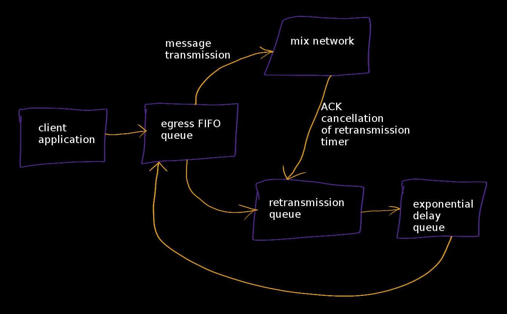
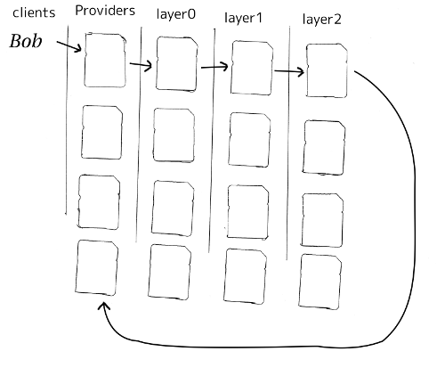
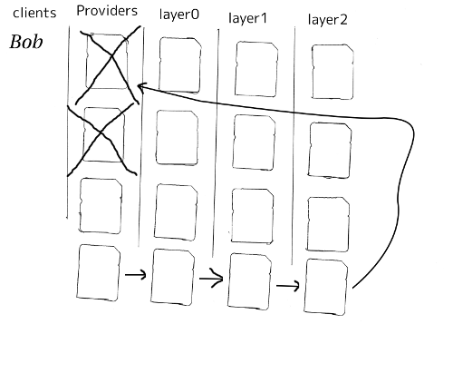
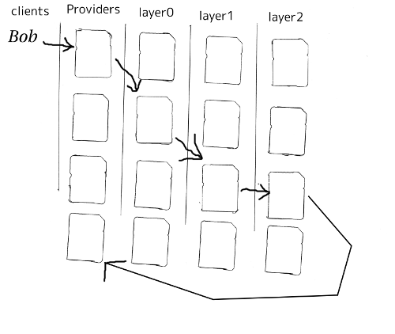
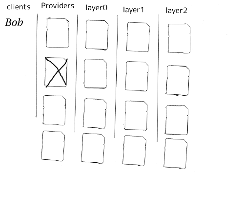
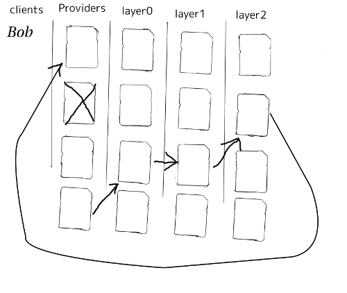

**Abstract**

This document describes the design of a client software library, a
minimal message oriented network transport protocol library. It is meant
to be read along with [KATZDECOY](#KATZDECOY) and
[KATZDEADDROP](#KATZDEADDROP).

## 1. Introduction

This design document illuminates many complex mixnet client design
considerations that are not already covered by "Katzenpost Mix Network
End-to-end Protocol Specification"
[KATZMIXE2E](#KATZMIXE2E). Moreover, the existing
Katzenpost minimal reference client, minclient, can be found here:

- https://github.com/katzenpost/katzenpost/minclient

Minclient is very low level and, in most cases, should not be used
directly to compose mixnet client applications. In contrast we shall
herein describe the design of a client library which provides two
categories of message oriented bidirectional communication channels:

1. Client to client
2. Client to server (kaetzchen service as in [KAETZCHEN](#KAETZCHEN))

This library SHOULD be used to compose more sophisticated communication
channels which provide additional cryptographic security properties to
the client application such as:

- Forward secrecy
- Post-compromise security

We shall describe the design considerations for several variations of
mixnet communication protocols:

- Unreliable location-hiding client to client
- Reliable location-hiding client to client
- Unreliable client to server
- Reliable client to server
- Client to server publish-subscribe

In all these cases, message delivery will be out-of-order whether or not
it is reliable.

### 1.1 Conventions Used in This Document

The key words "MUST", "MUST NOT", "REQUIRED", "SHALL", "SHALL
NOT", "SHOULD", "SHOULD NOT", "RECOMMENDED", "MAY", and
"OPTIONAL" in this document are to be interpreted as described in
[RFC2119](#RFC2119).

### 1.2 Terminology

- `ACK` - A protocol acknowledgment message.
- `ARQ` - Automatic Repeat reQuest is an error correction method which
  requires two-way communication and incurs a delay penalty when used.
- `AQM` - Active Queue Management algorithm.
- `Provider` - A service operated by a third party that Clients
  communicate directly with to communicate with the Mixnet. It is
  responsible for Client authentication, forwarding outgoing messages
  to the Mixnet, and storing incoming messages for the Client. The
  Provider MUST have the ability to perform cryptographic operations
  on the relayed packets.
- `local Provider` - A Provider which clients connect to directly
  using our link layer protocol [KATZMIXWIRE](#KATZMIXWIRE).
- `remote Provider` - A Provider which clients DO NOT connect directly
  to and, instead, make use of our dead drop message retrieval
  protocol [KATZDEADDROP](#KATZDEADDROP).

## 2. Protocol Overview

Client's make use of decoy traffic as described in
[KATZDECOY](#KATZDECOY) However, unlike the
[LOOPIX](#LOOPIX) design, clients do NOT give one another
their Provider and spool identities. Instead, clients exchange *dead
drop information* so they can retrieve messages while hiding their
Provider information and location on the network, as described in
[KATZDEADDROP](#KATZDEADDROP).

Not all applications will make use of this "client to client"
communication pattern and instead may require clients to communicate
with mixnet services with a SURB based query and response protocol as
described in [KAETZCHEN](#KAETZCHEN).

## 3. Message Retrieval

There are two types of message retrieval that are possible. They are:

- Retrieval from a local Provider
- Retrieval from a remote Provider (a.k.a. dead drop as described in [KATZDEADDROP](#KATZDEADDROP))

### 3.1 Message Retrieval from local Provider

This refers to `Retrieval from a local Provider`, as described in the
[LOOPIX](#LOOPIX) paper and in section `3. Client and Provider Core Protocol` of the
[KATZMIXE2E](#KATZMIXE2E) document. It is relevant as
message retrieval from dead drops causes messages to be delivered into
the client's Provider and must then be retrieved using the wire
protocol directly.

### 3.2 Message Retrieval from remote Provider

This refers to `Retrieval from remote Provider`, as defined in the `Katzenpost
Dead Drop Extension` [KATZDEADDROP](#KATZDEADDROP) specification document. The
document goes into detail around how the remote Provider can be queried over the
mixnet.

### 3.3 Conclusion

Mutual distrust also known as `location hiding properties` are not
cost-free properties. The cost is increased by client complexity and by
the latency of message retrieval.

## 4. Message orientation considerations

Mix networks are inherently message oriented. Because of this, we do not
seek to change this fundamental property in our mix network protocol.
However, it is possible to create a higher level protocol which have
different properties than the ones presented by the Sphinx packet format
and our low level mix network protocols.

It may be useful to send messages with an arbitrary size. Stream
orientation sends bytes of data to the application as soon as the
ordered bytes are available; whereas, the ability to send arbitrarily
sized messages is qualitatively from a different protocol category. This
is different because in our message oriented scheme, data is only
presented to the application once reassembly of the entire message is
completed.

Certainly it is possible to construct a stream oriented protocol given
our low level message oriented mix network protocol design. However, at
this time, we do not have sufficient motivation to explore this area of
design space. Arbitrarily sized messages (achieved by the usage of
padding and fragmentation) is sufficient for all of the applications we
are currently considering for integration with the mix network.

Our message padding and fragmentation scheme is described in detail in
[KATZMIXE2E](#KATZMIXE2E).

## 5. Reliability

Reliable messaging via our mixnet ARQ protocol scheme is used with
messages to clients and service queries [KAETZCHEN](#KAETZCHEN) as well.

### 5.1 Reliability

As stated in [KATZMIXE2E](#KATZMIXE2E), our ARQ protocol scheme MUST obey the
following rules:

- All retransmitted blocks MUST be re-encrypted, and have a entirely
  new set of paths and delays. In simple terms, this means re-doing
  the packet creation/transmission from step 2 for each retransmitted block.
- Senders MUST NOT retransmit blocks at a rate faster than one block
  per 3 seconds.
- Retransmissions must NOT have predictable timing, otherwise, it will
  expose the destination Provider to discovery by a powerful adversary
  that can perform active confirmation attacks.
- Senders MUST NOT attempt to retransmit blocks indefinitely, and,
  instead, give up on the entire message when it fails to arrive after
  a certain number of retransmissions.

Due to the usage of the Poisson mix strategy, the client knows the
approximate round trip time. This eliminates the need to perform round
trip time estimates, as is the case with TCP.

### 5.1.1 ARQ Implementation Considerations

When a SURB reply is received by a client, this means the client
receives a ciphertext payload and a SURB ID. This SURB ID tells our ARQ
statemachine which message is being acknowledged. The client uses the
SURB ID to determine which private key it should use for decrypting the
ciphertext.

The two SURB reply cases currently are:

- SURB ACKnowledgments
- SURB replies from service queries

In the case of a SURB-ACK the payload plaintext should be all zero bytes
(0x00) whereas replies from service queries have no such restriction.

A client's retransmission intervals MUST NOT be predictable or an
active confirmation attack can be performed to discover the client\'s
Provider. Furthermore, classical network literature states that we must
have an exponential backoff for retransmissions.
[CONGAVOID](#CONGAVOID), [SMODELS](#SMODELS), or [RFC896](#RFC896).
Therefore clients MUST randomize retransmission intervals with the lower
bounds being set by the exponential curve or by a linear approximation
of such.

In practice, these two delays can be implemented using priority queues
where the priority is set to the future expiration time. Early
cancellations can be marked as such using a hashmap to avoid doing a
linear scan of the priority queue.

Diagram of AQMs:

Description of AQMs:

- `egress queue` - The egress FIFO queue receives messages from the
  application and retransmissions from the exp. delay queue. Messages
  are popped off the queue at the timing determined by the λP Poisson
  process.
- `retransmission queue` - The retransmission queue is a priority
  queue which is prioritized by the future expected round trip time
  and supports cancellation by reply or ACK events.
- `exponential delay queue` - The exponential delay queue is another
  priority queue prioritized by a future time, however there are no
  cancellations for this active queue management algorithm.

Other than these queues, the client will have to do plenty of other
state mutation and book keeping for each sent message. Before we discuss
the metadata clients will use, we first need to consider the various
communication channel types:

- `service query channels` - As specified in
  [KAETZCHEN](#KAETZCHEN) specification, service
  queries are encrypted with the Sphinx packet format end to end from
  client to destination Provider only. It is acceptable to let the
  destination Provider view the payload plaintext since the service
  being queried is also hosted on the Provider. SURB replies however
  are end to end encrypted all the way to the client. This channel is
  oddly similar to a half duplex network link in that the reply
  channel is not available to the service until the query with the
  SURB is received.
- `client to client channels` - This channel type requires the use of
  an additional encryption layer encapsulated by the Sphinx packet to
  protect some of the metadata from the destination Provider. As
  specified in [KATZMIXE2E](#KATZMIXE2E), each
  retransmission must be encrypted with
  `Noise_X_25519_ChaChaPoly_Blake2b` thus resulting in differing
  ciphertexts. To construct this channel, the two clients must
  exchange receiving usernames/Providers and public X25519 keys. This
  channel type supports mutual location hiding when clients exchange
  Providers which they do not directly connect to as specified in
  [KATZDEADDROP](#KATZDEADDROP).

This ARQ scheme should work for both of these channel types. Each
message will have the following metadata:

- Message ID
- Message type
- Number of retransmissions
- SURB ID
- SURB payload decryption key
- Recipient user
- Recipient Provider

## X. Cryptographic Persistent Storage

TODO: further discuss pros and cons of NOT having any state persistence
to disk.

Leaning towards NOT having any state persistence to disk because it
reduces implementation complexity.

## X. Anonymity Considerations

### X.1 Retransmissions

Mix network ARQ protocol error correction schemes MUST NOT have
predictable timing between retransmissions otherwise it exposes the
route destination to discovery by an adversary that can perform active
confirmation attacks.

Consider the following scenario: Bob retrieves one message at a time
from his remote Provider AND an adversary has compromised his remote
Provider. This adversary also has the capability to cause arbitrary
outages in the mix network. The goal of the adversary is to discover
Bob's local Provider.

Bob sends a SURB to his remote Provider to retrieve the first message:

The adversary causes an outage for half of the Providers in the network:

During this outage the remote Provider uses the SURB to s end the reply back to
Bob's local Provider which is currently unable to receive messages from the mix
network:

Lacking any response within his round trip timeout duration, Bob
retransmits the same message retreival command. Since the adversary has
compromised Bob's remote Provider, they are now aware that Bob's
Provider must be one of the Providers among the set of Providers which
had the outage:

The adversay then causes an outage for half of the set previously made
to have an outage:

The remote Provider sends it\'s response to Bob's local Provider via
the SURB Bob sent. In this case, the outage happens to not affect Bob's
local Provider and, therefore, Bob increments his sequence number for
the next message retrieval:

At this point, if Bob sends another message retrieval command with the
incremented message sequence number, then it's game over for Bob
because the adversary will known exactly which is Bob's local Provider.
This attack is rather powerful in that the adversary is essentially
performing a search in logarithmic time with respect to the total number
of Providers in the network.

## X. Security Considerations

## X. Acknowledgements

This client design is inspired by "The Loopix Anonymity System"
[LOOPIX](#LOOPIX) and in particular the specific decoy
traffic design comes from conversations with Claudia Diaz and Ania
Piotrowska.

## Appendix A. References

### Appendix A.1 Normative References

### Appendix A.2 Informative References

## Appendix B. Notes on persistent storage

Storage persistence shall have multiple implementations:

- Cryptographic storage to disk
- Plaintext memory storage

Storage API for communications metadata.

- Records state of messages and SURB IDs for service replies or
  message acknowledgements. Items persisted link a specific queries
  with their replies. In the case of reliable messages ... In the
  case of a service query

Information that is contained in the metadata storage consists of:

- Message ID, SURB ID, status triples
- Message indices?

Information that is NOT stored in the metadata storage and is up to the
consumer of the client API to implement:

- Contents of messages
- Contacts of clients
- Anything implemented by the API consumer

Implementations

- In memory implementation. Nothing is persisted to disk, and all
  state is lost at program exit. No reliability guarantees exist after
  a client instance is terminated.
- On disk implementation. Message metadata is retained to disk for
  `<duration>` or until a message is acknowledged or a response is
  received. Upon restarting a client this metadata repository is
  loaded from disk.

API methods (subject to change)

- Create initializes a metadata store
- Read loads a metadata store from disk
- Write writes a metadata store to disk
- Destroy erases a metadata store from disk

Each store item contains one CBOR serialized structure that is
deserialized into program memory at client initialization. At client
graceful shutdown, state is stored to disk by serializing the in-memory
structure and writing it to disk. The storage API does NOT provide
journaling or fault handling in the event of a program crash.

**CONGAVOID**

Jacobson, V., Karels, M.,
"Congestion Avoidance and Control",
Symposium proceedings on Communications architectures and protocols,
November 1988,
http://ee.lbl.gov/papers/congavoid.pdf

**KAETZCHEN**

Angel, Y., Kaneko, K., Stainton, D.,
"Katzenpost Provider-side Autoresponder",
January 2018,
https://github.com/katzenpost/katzenpost/blob/main/docs/specs/kaetzchen.md

**KATZDEADDROP**

Stainton, D.,
"Katzenpost Dead Drop Extension",
February 2018,
https://github.com/katzenpost/katzenpost/blob/main/docs/drafts/deaddrop.md

**KATZDECOY**

Stainton, D.,
"Katzenpost Mix Network Decoy Traffic Specification",
February 2019,
https://github.com/katzenpost/katzenpost/blob/main/docs/drafts/decoy_traffic.md

**KATZMIXE2E**

Angel, Y., Danezis, G., Diaz, C., Piotrowska, A., Stainton, D.,
"Katzenpost Mix Network End-to-end Protocol Specification",
July 2017,
https://github.com/katzenpost/katzenpost/blob/main/docs/specs/old/end_to_end.md

**KATZMIXNET**

Angel, Y., Danezis, G., Diaz, C., Piotrowska, A., Stainton, D.,
"Katzenpost Mix Network Specification",
June 2017,
https://github.com/katzenpost/katzenpost/blob/main/docs/specs/mixnet.md

**KATZMIXWIRE**

Angel, Y., Stainton, D.,
"Katzenpost Mix Network Wire Protocol Specification",
August 2017,
https://github.com/katzenpost/katzenpost/blob/main/docs/specs/wire-protocol.md

**LOOPIX**

Piotrowska, A., Hayes, J., Elahi, T., Meiser, S., Danezis, G.,
"The Loopix Anonymity System",
USENIX,
August, 2017
https://arxiv.org/pdf/1703.00536.pdf

**RFC2119**

Bradner, S.,
"Key words for use in RFCs to Indicate Requirement Levels",
BCP 14, RFC 2119, DOI 10.17487/RFC2119,
March 1997,
http://www.rfc-editor.org/info/rfc2119

**RFC896**

Nagle, J.,
"Congestion Control in IP/TCP Internetworks",
January 1984,
https://tools.ietf.org/html/rfc896

**SMODELS**

Kelly, F.,
"Stochastic Models of Computer Communication Systems",
Journal of the Royal Statistical Society,
1985,
http://www.yaroslavvb.com/papers/notes/kelly-stochastic.pdf

**SPHINXSPEC**

Angel, Y., Danezis, G., Diaz, C., Piotrowska, A., Stainton, D.,
"Sphinx Mix Network Cryptographic Packet Format Specification"
July 2017,
https://github.com/katzenpost/katzenpost/blob/main/docs/specs/sphinx.md
