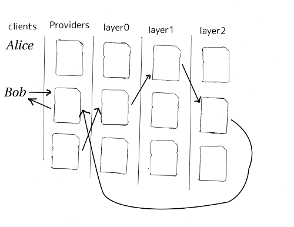

**Abstract**

This document describes the message dead drop service. The dead drop
service can be used to compose messaging systems with stronger location
hiding properties, and increased resistance to longterm statistical
disclosure attacks also known as intersection attacks.

## 1. Introduction

The dead drop service is implemented as a Provider side autoresponder
service [KAETZCHEN](#KAETZCHEN), it provides clients with
the ability to retrieve messages from remote Providers. This
unidirectional dead drop scheme should leak less information than a
bidirectional dead drop. This document does not describe the full design
of a message system. Instead we merely specify a mixnet dead drop
service which can be one of many design elements used to compose a
messaging system.

### 1.1 Conventions Used in This Document

The key words "MUST", "MUST NOT", "REQUIRED", "SHALL", "SHALL
NOT", "SHOULD", "SHOULD NOT", "RECOMMENDED", "MAY", and
"OPTIONAL" in this document are to be interpreted as described in
[RFC2119](#RFC2119).

### 1.2 Terminology

`Provider` - A service, operated by a third party, that Clients
communicate directly with to communicate with the Mixnet. It is
responsible for Client authentication, forwarding outgoing messages to
the Mixnet, and storing incoming messages for the Client. The Provider
MUST have the ability to perform cryptographic operations on the relayed
messages.

`SURB` - Single Use Reply Block is a cryptographic delivery token which was
first introduced by the Mixminion design [MIXMINION](#MIXMINION) and revised by
the Sphinx cryptographic packet format. [SPHINX](#SPHINX)
[SPHINXSPEC](#SPHINXSPEC)

# 2. Overview

A client possessing the dead drop address sends a message to a dead drop just
like a normal Katzenpost message [KATZMIXE2E](#KATZMIXE2E). However the receiver
of the message uses the dead drop Kaetzchen service to retrieve messages by
sending one or more SURBs to the dead drop.

Consider this diagram where Alice sends a message to Bob's spool on his
remote Provider:


At a latter time, Bob sends a SURB to his remote Provider to retrieve a
message from his spool:


The messages return trip from remote Provider to Bob's local Provider
can look like this:


Finally, Bob retrieves the message from his local Provider:



## 3. Protocol Messages

The DeadDropRequest is sent to the dead drop service with a SURB that is
used to send the DeadDropResponse back to the client.

### 3.1 DeadDropRequest message

Dead drop requests are authenticated by the Provider's user authentication
database similar to how Katzenpost Providers authenticate client wire protocol
connections, as detailed in [KATZMIXWIRE](#KATZMIXWIRE) and
[KATZMIXE2E](#KATZMIXE2E). In this case, we are coupling the User and AuthToken
fields in the DeadDropRequest to provide the needed authentication information.

```
{
    "Version": 0,
    "User": "Alice",
    "AuthToken": "yczzyO30cLKtoh/BDAOfyIDjb6nwe6l/ebuVDDhN+Q8boxB7SHG8IS4NFp62LEZg",
    "Ack": 0
}
```

- The User field is a string which the Provider associates with a
  X25519 public key AND a message spool.
- The AuthToken field is a base64 encoded ciphertext blob produced by
  encrypting a zero length payload with
  `Noise_K_25519_ChaChaPoly_Blake2b` using the user's
  link key, which the Katzenpost system uses for link layer
  authentication [KATZMIXWIRE](#KATZMIXWIRE).

The encrypted and authenticated blob has the following structure:

```
// XXX Correct?

struct {
    opaque noise_e[32]; 
    opaque noise_mac[16];
} BlockCiphertext;
```
- `noise_e` The Noise handshake `e`
- `noise_mac` - The Noise ciphertext `MAC`
- The Ack field defaults to zero unless the user has had a previous
  interaction where a DeadDropResponse was received. In that case the
  previously received Sequence numbers are placed into this Ack field
  which causes the deaddrop service to purge the associated messages.


### 3.2. DeadDropResponse message

```
{
    "Version": 0,
    "StatusCode": 0,
    "QueueHint": 0,
    "Sequence": 0,
    "Payload": ""
}
```

- The StatusCode field is used to report errors to the client if any.
  Valid status codes are:

```
enum {
    status_ok(0),
    status_syntax_error(1),
    status_no_identity(2),
    status_auth_error(3),   
} StatusCodes;
```

- `status_ok` - No error condition. SHOULD be accompanied by valid message payload.
- `status_syntax_error` - The request was malformed. 
- `status_no_identity` - No such identity was found.
- `status_auth_error`- Authentication failure. 

- QueueHint is used to inform the client how many more messages are queued.
- Sequence is used by the server to decide when to permanently delete
  a message. When the next request message is received containing this
  sequence number then the associated message is purged.
- Payload is used to encapsulate one or more messages.

## 4. Dead Drop Descriptor

Dead drop descriptors can be exchanged between clients to establish
communication channels.

```
{
    "Version": 0,
    "TimeoutUnixEpoch": 12345,
    "DeadDropAddress": "fe37a524ce6410a59718@provider-0.example.org"
}
```

- The TimeoutUnixEpoch field is used to specify the timeout in Unix epoch format.
- The DeadDropAddress field is used to specify the dead drop slot on the remote Provider.

# 5. Anonymity Considerations

- Collusion of Providers might make it possible to link an account on
  two different Providers. That is, given user's dead drop, an
  attacker can discover if the two Providers collude. However, this
  linkage may require a longterm statistical disclosure attack. In
  that case, these longterm attacks might not converge on success if
  deaddrops are rotated frequently enough.
- Sending a deaddrop request with many bundled SURBs increases
  exposure to compulsion attack by the remote Provider.
- Sending a deaddrop request with many bundled SURBs exposes the
  client to a potential active confirmation attack where the remote
  Provider uses all of the SURBs to send messages concurrently. The
  adversary then tries to determine if there is an observed
  confirmation on the network exposing the destination of these SURB
  reply messages. In the [LOOPIX](#LOOPIX) Provider
  model the attacker might try to determine if any of the Providers
  receive slightly more messages. If the adversary has compromised one
  or more Providers, then the goal would be to determine if one
  message spool receives more messages than the rest.
- Client retransmissions can be predictable behavior which allows for
  active confirmation attacks which can discover the client's
  Provider. Consider for instance Alice and Bob where Alice is a
  powerful adversary that wishes to discover Bob\'s Provider. Alice
  compromises the server which hosts Bob's dead drop service. Alice
  knows when Bob sends a Message Retrieval command. In response to
  these Message Retrieval commands Alice then blocks one or more
  Providers and sends the response to the client using the supplied
  SURB. If another Message Retrieval command is received, it is likely
  that this retransmission confirms that the SURB Response was not
  received by the client because of blocking messages to one or more
  Providers. Alice uses these active confirmation attacks in a binary
  search to quickly discover Bob's Provider.

## 6. Security Considerations

- End to end message integrity and confidentiality from client to
  Provider is ensured by the Sphinx cryptographic packet format.
- The dead drop service authenticates message retrieval requests using
  a cryptographic token produced using the one-way Noise pattern *K*,
  in the construction `Noise_K_25519_ChaChaPoly_Blake2b`.

## 7. Future Work

It should be possible to increase the communication channel efficiency
by sending DeadDropRequest messages supplied with multiple SURBs.
However, this must be carefully balanced with the resulting exposure to
statistical disclosure and compulsion attacks.

## Appendix A. References

### Appendix A.1 Normative References

### Appendix A.2 Informative References

**KAETZCHEN**

Angel, Y., Kaneko, K., Stainton, D.,
"Katzenpost Provider-side Autoresponder",
January 2018,
https://github.com/katzenpost/katzenpost/blob/main/docs/specs/kaetzchen.md

**KATZMIXE2E**

Angel, Y., Danezis, G., Diaz, C., Piotrowska, A., Stainton, D.,
"Katzenpost Mix Network End-to-end Protocol Specification",
July 2017,
https://github.com/katzenpost/katzenpost/blob/main/docs/specs/old/end_to_end.md

**KATZMIXWIRE**

Angel, Y.
"Katzenpost Mix Network Wire Protocol Specification",
June 2017,
https://github.com/katzenpost/katzenpost/blob/main/docs/specs/wire-protocol.md

**LOOPIX**

Piotrowska, A., Hayes, J., Elahi, T., Meiser, S., Danezis, G.,
"The Loopix Anonymity System",
USENIX,
August, 2017
https://arxiv.org/pdf/1703.00536.pdf>

**MIXMINION**

Danezis, G., Dingledine, R., Mathewsom, N.,
"Mixminion: Design of a Type III Anonymous Remailer Protocol"
https://www.mixminion.net/minion-design

**NOISE**

Perrin, T.,
"The Noise Protocol Framework",
May 2017,
https://noiseprotocol.org/noise.pdf

**RFC2119**

Bradner, S.,
"Key words for use in RFCs to Indicate Requirement Levels",
BCP 14, RFC 2119, DOI 10.17487/RFC2119,
March 1997,
http://www.rfc-editor.org/info/rfc2119>

**SPHINX**

Danezis, G., Goldberg, I.,
"Sphinx: A Compact and Provably Secure Mix Format",
DOI 10.1109/SP.2009.15,
May 2009,
https://cypherpunks.ca/~iang/pubs/Sphinx_Oakland09.pdf

**SPHINXSPEC**

Angel, Y., Danezis, G., Diaz, C., Piotrowska, A., Stainton, D.,
"Sphinx Mix Network Cryptographic Packet Format Specification"
July 2017,
https://github.com/katzenpost/katzenpost/blob/main/docs/specs/sphinx.md
