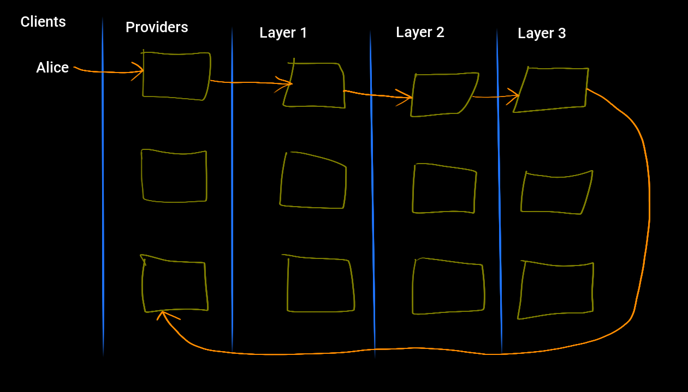
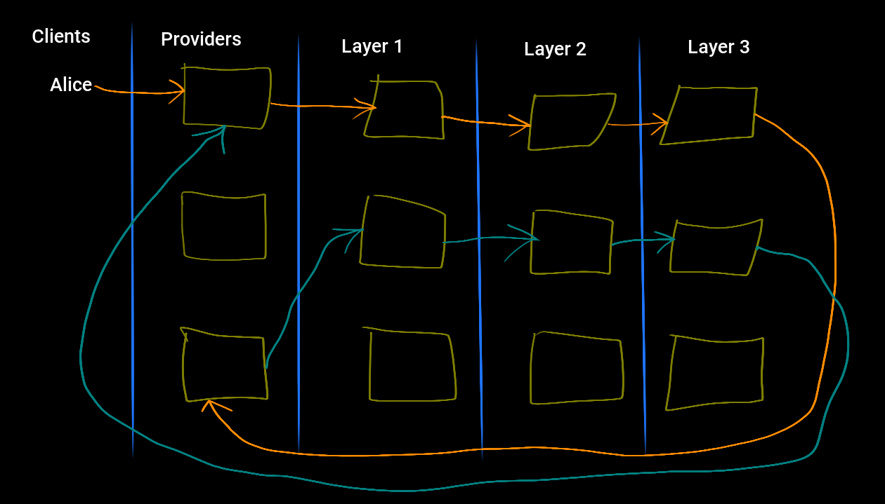

**Abstract**

This document describes the various types of decoy traffic designs based
on the [LOOPIX](#LOOPIX) paper and is meant to be read
with [KATZCLIENT](#KATZCLIENT) and [KATZDEADDROP](#KATZDEADDROP).

## 1. Introduction

To a passive network observer or a component mix, decoy traffic (often
referred as "cover traffic" or dummy messages) is indistinguishable
from normal traffic. The [LOOPIX](#LOOPIX) and
[ANONTRILEMMA](#ANONTRILEMMA) papers describe a trade off
between latency and decoy traffic. Decoy traffic adds entropy to
component mixes, which means that more decoy traffic can be used so
lower per hop delay is used, while still maintaining the desired mix
entropy.

Decoy traffic loops are used by mixes to detect *n-1* attacks
[HEARTBEAT03](#HEARTBEAT03). This means that mix decoy
loop traffic serves a dual purpose of detecting *n-1* attacks while
contributing entropy to various mixes.

Decoy traffic also contributes to sender and receiver unobservability. A
global passive adversary will not be able to determine whether a user is
communicating with another (by either sending or receiving messages), as
observed honest messages are indistinguishable from decoy messages.

The [LOOPIX](#LOOPIX) design specifies a slightly
different decoy traffic profile than the one described here. The Loopix
design does not attempt to achieve any reliability, while the present
document does. Fundamentally, mix networks are unreliable packet
switching networks: without the use of additional client side protocols,
they cannot achieve reliability. The Katzenpost design, on the other
hand, aims to achieve reliability through the use of an automatic repeat
request (ARQ) protocol scheme. An ARQ protocol is a type of error
correction protocol that makes use of acknowledgement control messages
and retransmissions. The most notable example of a protocol making use
of an ARQ scheme is TCP.

The [LOOPIX](#LOOPIX) design achieves it\'s security
goals of sender and receiver unobservability with respect to compromised
providers and passive network observers. It does so by using two types
of client decoy traffic. In the Katzenpost design, clients must use two
SURB loops instead of the routing loops that are described in the Loopix
paper. This is because client Providers never receive decoy traffic and
instead only receive SURB replies.

## 1.1 Conventions Used in This Document

The key words "MUST", "MUST NOT", "REQUIRED", "SHALL", "SHALL
NOT", "SHOULD", "SHOULD NOT", "RECOMMENDED", "MAY", and
"OPTIONAL" in this document are to be interpreted as described in
[RFC2119](#RFC2119).

### 1.2 Terminology

- `decoy traffic` - Mix network messages that add entropy and help
  defend against certain kind of attacks. Also referred to as dummy or
  cover traffic.
- `message` - A variable-length sequence of bytes sent anonymously
  through the network. Short messages are sent in a single packet;
  long messages are fragmented across multiple packets (see
  [KATZMIXE2E](#KATZMIXE2E)).
- `packet` - A Sphinx packet is a nested cryptographic packet which is
  described in [SPHINX](#SPHINX) and
  [SPHINXSPEC](#SPHINXSPEC).
- `forward message` - A message sent using a Sphinx packet with the
  terminal hop routing slot containing only a `recipient` Sphinx
  routing comment. This Sphinx packet contains a `SURB` in the payload
  so that the receiving Provider may reply with a `SURB ACK`.
- `ACK` - Acknowledgement. A control message used in ARQ protocols.
- `ARQ` - Automatic Repeat reQuest. An error correction protocol
  scheme which makes use of acknowledegement control messages and
  retransmissions.
- `SURB` - The Single Use Reply Block is a feature of the Sphinx
  packet format and is described in [SPHINX](#SPHINX)
  and in section `7. Single Use Reply Block (SURB) Creation` of
  [SPHINXSPEC](#SPHINXSPEC).
- `SURB reply` - A message sent using a Sphinx packet which is
  composed using a SURB where the last hop routing information
  contains a `surb_reply` routing command.
- `SURB ACK` - An acknowledgement control message is a `SURB reply`
  which contains a payload of all zeros rather than useful
  information. It acts as an important part of an ARQ protocol scheme.
- `service query` - A forward message whose destination is a
  Provider-side Autoresponder [KAETZCHEN](#KAETZCHEN)
  service.
- `query reply` - A message sent in reponse to a `service query` which
  is encapsulated in a Sphinx packet composed using a SURB. See
  [KAETZCHEN](#KAETZCHEN).

### 1.3 Preliminary Sphinx Routing Considerations

Section `4.1.1 Per-hop routing information` of the
[SPHINXSPEC](#SPHINXSPEC) states that the Sphinx packet
header contains a vector of per-hop routing information. Each mix in
turn decrypts it's portion of this routing information. In the case of
the final hop, the Provider decrypting this routing information should
find either a `recipient` command, or
`recipient` and `surb_reply` commands
[KATZMIXE2E](#KATZMIXE2E). Therefore Providers receiving
Sphinx packets are able to distinguish between `forward messages` and
replies generated using SURBs such as a `SURB ACK` or a `query reply`.

## 2. Client SURB Loops

SURB loops differ slightly from client and mix loops as described in the
[LOOPIX](#LOOPIX) paper; the return flight is routed by
means of a SURB. In other words, clients or mixes may form a SURB loop
by sending a message with a SURB to a Provider-side Autoresponder
[KAETZCHEN](#KAETZCHEN) `loop` service. This `loop`
service uses the SURB to send a reply back to the source.

In the Katzenpost mix network all Provider services respond using a SURB
and Providers also send a `SURB ACK` in response to receiving a
`forward messages`. From the perspective of the Provider receiving these
SURB replies, all of these messages are indistinguishable. That is,
`query replies` from a `loop service` are indistinguishable from
`query replies` from any other service. They are are indistinguishable
from `SURB ACKs`.

## 2.1 Sender Unobservability

Client SURB loops provide sender unobservability with respect to passive
network observers and compromised Providers. This means that, if the
client's Provider is compromised, the adversary gains no advantage, and
the client's SURB loops are indistinguishable from normal forward
traffic.

### 2.2 Receiver Unobservability

Client SURB loops provides receiver unobservability with respect to a
passive network adversary. That is, passive network adversaries are not
able to distinguish between SURB replies from a client SURB loop and
normal forward received messages.

However, if the client's Provider is compromised, the adversary will be
able to distinguish between the SURB reply and a received forward
message by means of the Sphinx routing commands.

## 4. Client Drop Decoys

The Katzenpost design defines client drop decoy messages by composing
Sphinx packets destined for the `loop service` of a randomly selected
Provider. The payload of this Sphinx packet does not contain a SURB and,
therefore, the `loop service` has no choice but to drop the message
without sending a response.

As stated in section `3. Client Routing Loops without SURBs`, clients
must send drop messages so that the number of sent and received messages
are not equal. This is used to thwart an adversary who has compromised
the client's Provider.

## 5. Client Decoy Traffic Conclusions

Clients send forward messages and decoy loop messages. Loop decoy
messages are addressed to the sending client whereas forward messages
are destined for other clients or servers. An idle client sends just as
many messages as a busy client on average.

Just as is described in the [LOOPIX](#LOOPIX) paper,
Client's make use for 4 Poisson processes, the first is used to select
delay for each hop:

- `μ` - Delay for each hop.

The next three Poisson processes are used by the client to select delays
between sending various types of messages into the mixnet:

- `λP` - Time interval between sending messages from the egress queue.
- `λL` - Loop traffic rate.
- `λD` - Drop traffic rate.

Unlike the Loopix paper, client loops use a SURB reply for it's return
flight back to the client. The λP Poisson process is used to set the
time interval between sending messages from the egress FIFO queue. If
the FIFO queue is empty then a decoy drop message is sent instead.

Here's a diagram which shows a client sending a message through the mix
network AND in this case the destination could be a Provider service or
the spool of another user on a Provider:

This next diagram shows the reply being routed back to the client by
means of the Single Use Reply Block (see
[SPHINXSPEC](#SPHINXSPEC)):

This is indistinguishable from client decoy loop messages.

## 6. Mix Loops For Detecting n-1 Attacks

*TODO: finish me.*

## X. Anonymity Considerations

A global adversary will be able to determine which users are online or
offline. Decoy traffic is not guaranteed to prevent long term
intersection attacks if users go offline.
[RESISTDISCLOSURE](#RESISTDISCLOSURE) Preventing long
term statistical disclosure attacks depends on many factors including
the type of applications using the mixnet, the rate of information
leakage and the measure of predictable and repetitive behavior.

## Y. Security Considerations

## Z. Acknowledgments

## Appendix A. References

### Appendix A.1 Normative References

### Appendix A.2 Informative References

[2SIDEDSDA]{#2SIDEDSDA .citation-label}

Danezis, G., Diaz, C., Troncoso, C.,
"Two-sided Statistical Disclosure Attack",
In the Proceedings of the PETS 2007,
https://www.freehaven.net/anonbib/cache/danezis-pet2007.pdf

[ANONLIMITS]{#ANONLIMITS .citation-label}

Kedogan, D., Agrawal, D., Penz, S.,
"Limits of Anonymity in Open Environments",
In the Proceedings of Information Hiding Workshop,
October 2002,
https://www.freehaven.net/anonbib/cache/limits-open.pdf

[ANONTRILEMMA]{#ANONTRILEMMA .citation-label}

Das, D., Meiser, S., Mohammadi, E., Kate, A.,
"Anonymity Trilemma: Strong Anonymity, Low Bandwidth Overhead, Low Latency---Choose Two",
IEEE Symposium on Security and Privacy,
2018,
https://eprint.iacr.org/2017/954.pdf

[DUMMYINTERSECTION]{#DUMMYINTERSECTION .citation-label}

Berthold, O., Langos, H.,
"Dummy Traffic Against Long Term Intersection Attacks",
In the Proceedings of the PETS 2002,
2022,
https://www.freehaven.net/anonbib/cache/langos02.pdf

[DUMMYLIMITS]{#DUMMYLIMITS .citation-label}

Oya, S., Troncoso, C., Pérez-González, F.
"Do dummies pay off? Limits of dummy traffic protection in anonymous communications",
https://www.freehaven.net/anonbib/cache/pets14-dummy-traffic.pdf

[HANGBUDDIES]{#HANGBUDDIES .citation-label}

Wolinksy, D., Syta, E., Ford, B.,
"Hang with Your Buddies to Resist Intersection Attacks",
In the Proceedings of the 20th ACM conference on CCS,
November 2013,
https://www.freehaven.net/anonbib/cache/ccs2013-buddies.pdf

[HEARTBEAT03]{#HEARTBEAT03 .citation-label}

Danezis, G., Sassaman, L.,
"Heartbeat Traffic to Counter (n-1) Attacks",
Proceedings of the Workshop on Privacy in the Electronic Society,
October 2003,
https://www.freehaven.net/anonbib/cache/danezis:wpes2003.pdf

[HITTINGSET]{#HITTINGSET .citation-label}

Kesdogan, D., Pimenidis, L.,
"The Hitting Set Attack on Anonymity Protocols",
In the Proceedings of 6th Information Hiding Workshop (IH 2004), Toronto,
May 2004,
https://www.freehaven.net/anonbib/cache/hitting-set04.pdf

[KAETZCHEN]{#KAETZCHEN .citation-label}

Angel, Y., Kaneko, K., Stainton, D.,
"Katzenpost Provider-side Autoresponder Extension",
January 2018,
https://github.com/katzenpost/katzenpost/blob/main/docs/specs/kaetzchen.md

[KATZCLIENT]{#KATZCLIENT .citation-label}

Stainton, D.,
"Katzenpost client library design specification",
February 2019,
https://github.com/katzenpost/katzenpost/blob/main/docs/drafts/client.md

[KATZDEADDROP]{#KATZDEADDROP .citation-label}

Stainton, D.,
"Katzenpost Dead Drop Extension",
February 2018,
https://github.com/katzenpost/katzenpost/blob/main/docs/drafts/deaddrop.md

[KATZMIXE2E]{#KATZMIXE2E .citation-label}

Angel, Y., Danezis, G., Diaz, C., Piotrowska, A., Stainton, D.,
"Katzenpost Mix Network End-to-end Protocol Specification",
July 2017,
https://github.com/katzenpost/katzenpost/blob/main/docs/specs/old/end_to_end.md

[KESDOGAN98]{#KESDOGAN98 .citation-label}

Kesdogan, D., Egner, J., and Büschkes, R.,
"Stop-and-Go-MIXes Providing Probabilistic Anonymity in an Open System."
Information Hiding,
1998.

[LEASTSQUARESSDA]{#LEASTSQUARESSDA .citation-label}

Perez-Gonzalez, F., Troncoso, C.,
"Understanding Statistical Disclosure: A Least Squares approach",
In the Proceedings of the PETS 2012,
2012
https://www.freehaven.net/anonbib/cache/leastsquares-pets12.pdf

[LEASTSQUARESSDA2]{#LEASTSQUARESSDA2 .citation-label}

Perez-Gonzalez, F., Troncoso, C.,
"A Least Squares Approach to the Static Traffic Analysis of High-Latency Anonymous Communication Systems",
https://software.imdea.org/~carmela.troncoso/papers/PerezGonzalezTIFS14.pdf

[LOOPIX]{#LOOPIX .citation-label}

Piotrowska, A., Hayes, J., Elahi, T., Meiser, S., and Danezis, G.,
"The Loopix Anonymity System",
USENIX, August,
2017
https://arxiv.org/pdf/1703.00536.pdf

[MIXDUMMY]{#MIXDUMMY .citation-label}

Diaz, C., Preneel, B.,
"Taxonomy of Mixes and Dummy Traffic",
https://www.freehaven.net/anonbib/cache/taxonomy-dummy.pdf

[PERFECTMATCHING]{#PERFECTMATCHING .citation-label}

Troncoso, C., Gierlichs, B., Preneel, B., Verbauwhede, I.,
"Perfect Matching Disclosure Attacks",
In the Proceedings of the PETS 2008,
https://www.freehaven.net/anonbib/cache/troncoso-pet2008.pdf

[POOLDUMMY]{#POOLDUMMY .citation-label}

Diaz, C., Preneel, B.,
"Reasoning about the Anonymity Provided by Pool Mixes that Generate Dummy Traffic",
https://www.freehaven.net/anonbib/cache/pool-dummy04.pdf

[RESISTDISCLOSURE]{#RESISTDISCLOSURE .citation-label}

Mathewson, N., Dingledine, R.,
"Practical Traffic Analysis: Extending and Resisting Statistical Disclosure",
https://www.freehaven.net/anonbib/cache/e2e-traffic.pdf

[RFC2119]{#RFC2119 .citation-label}

Bradner, S.,
"Key words for use in RFCs to Indicate Requirement Levels",
BCP 14, RFC 2119, DOI 10.17487/RFC2119,
March 1997,
http://www.rfc-editor.org/info/rfc2119

[SDA]{#SDA .citation-label}

Danezis, G.,
"Statistical Disclosure Attacks: Traffic Confirmation in Open Environments",
In the Proceedings of Security and Privacy in the Age of Uncertainty,
May 2003,
https://www.freehaven.net/anonbib/cache/statistical-disclosure.pdf

[SPHINX]{#SPHINX .citation-label}

Danezis, G., Goldberg, I.,
"Sphinx: A Compact and Provably Secure Mix Format",
DOI 10.1109/SP.2009.15,
May 2009,
https://cypherpunks.ca/~iang/pubs/Sphinx_Oakland09.pdf

[SPHINXSPEC]{#SPHINXSPEC .citation-label}

Angel, Y., Danezis, G., Diaz, C., Piotrowska, A., Stainton, D.,
"Sphinx Mix Network Cryptographic Packet Format Specification"
July 2017,
https://github.com/katzenpost/katzenpost/blob/main/docs/specs/sphinx.md

[STATSDISCO]{#STATSDISCO .citation-label}

Danezis, G., Serjantov, A.,
"Statistical Disclosure or Intersection Attacks on Anonymity Systems",
In the Proceedings of 6th Information Hiding Workshop (IH 2004), Toronto,
May 2004.
https://www.freehaven.net/anonbib/cache/DanSer04.ps

[TRICKLE02]{#TRICKLE02 .citation-label}

Serjantov, A., Dingledine, R., Syverson, P.,
"From a Trickle to a Flood: Active Attacks on Several Mix Types",
Proceedings of Information Hiding Workshop,
October 2002,
https://www.freehaven.net/anonbib/cache/trickle02.pdf
