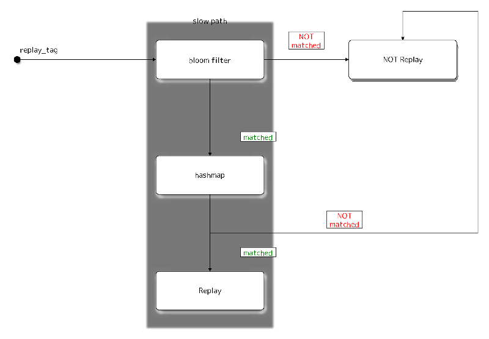

**Abstract**

This document defines the replay detection for any protocol that uses
Sphinx cryptographic packet format. This document is meant to serve as
an implementation guide and document the existing replay protect for
deployed mix networks.

## 1. Introduction

The Sphinx cryptographic packet format is a compact and provably secure
design introduced by George Danezis and Ian Goldberg
[SPHINX09](#SPHINX09). Although it supports replay
detection, the exact mechanism of replay detection is neither described
in [SPHINX09](#SPHINX09) nor is it described in our
[SPHINXSPEC](#SPHINXSPEC). Therefore we shall describe in
detail how to efficiently detect Sphinx packet replay attacks.

### 1.1 Terminology

- `Epoch` - A fixed time interval defined in section "4.2 Sphinx Mix
  and Provider Key Rotation" of [KATZMIXNET](#KATZMIXNET).
- `Packet` - A fixed-length sequence of bytes transmitted through the
  network, containing the encrypted message and metadata for routing.
- `Header` - The packet header consisting of several components, which
  convey the information necessary to verify packet integrity and
  correctly process the packet.
- `Payload` - The fixed-length portion of a packet containing an
  encrypted message or part of a message, to be delivered.
- `Group` - A finite set of elements and a binary operation that
  satisfy the properties of closure, associativity, invertability, and
  the presence of an identity element.
- `Group element` - An individual element of the group.
- `Group generator` - A group element capable of generating any other
  element of the group, via repeated applications of the generator and
  the group operation.

`SEDA` - Staged Event Driven Architecture.
[SEDA](#SEDA) 1. A highly parallelizable computation
model. 2. A computational pipeline composed of multiple stages connected
by queues utilizing active queue management algorithms that can evict
items from the queue based on dwell time or other criteria where each
stage is a thread pool. 3. The only correct way to efficiently implement
a software based router on general purpose computing hardware.

### 1.2 Conventions Used in This Document

The key words "MUST", "MUST NOT", "REQUIRED", "SHALL", "SHALL
NOT", "SHOULD", "SHOULD NOT", "RECOMMENDED", "MAY", and
"OPTIONAL" in this document are to be interpreted as described in
[RFC2119](#RFC2119).

## 2. Sphinx Cryptographic Primitives

This specification borrows the following cryptographic primitives
constants from our [SPHINXSPEC](#SPHINXSPEC):

- `H(M)` - A cryptographic hash function which takes an byte array M
  to produce a digest consisting of a `HASH_LENGTH` byte array. `H(M)`
  MUST be pre-image and collision resistant.

- `EXP(X, Y)` - An exponentiation function which takes the
  `GROUP_ELEMENT_LENGTH` byte array group elements `X` and `Y`, and
  returns `X ^^ Y` as a `GROUP_ELEMENT_LENGTH` byte array.

Let `G` denote the generator of the group, and `EXP_KEYGEN()` return
a `GROUP_ELEMENT_LENGTH` byte array group element usable as private
key.

The group defined by `G` and `EXP(X, Y)` MUST satisfy the Decision
Diffie-Hellman problem.

### 2.1 Sphinx Parameter Constants

- `HASH_LENGTH` - 32 bytes. Katzenpost currently uses SHA-512/256. [RFC6234](#RFC6234)
- `GROUP_ELEMENT_LENGTH` - 32 bytes. Katzenpost currently uses X25519. [RFC7748](#RFC7748)

## 3. System Overview

Mixes as currently deployed, have two modes of operation:

1. Sphinx routing keys and replay caches are persisted to disk
2. Sphinx routing keys and replay caches are persisted to memory

These two modes of operation fundamentally represent a tradeoff between
mix server availability and notional compulsion attack resistance.
Ultimately it will be the mix operator's decision to make since they
affect the security and availability of their mix servers. In particular
since mix networks are vulnerable to the various types of compulsion
attacks (see [SPHINXSPEC](#SPHINXSPEC) section 9.4
Compulsion Threat Considerations) and therefore there is some advantage
to NOT persisting the Sphinx routing keys to disk. The mix operator can
simply poweroff the mix server before seizure rather than physically
destroying the disk in order to prevent capture of the Sphinx routing
keys. An argument can be made for the use of full disk encryption,
however this may not be practical for servers hosted in remote
locations.

On the other hand, persisting Sphinx routing keys and replay caches to
disk is useful because it allows mix operators to shutdown their mix
server for maintenance purposes without loosing these Sphinx routing
keys and replay caches. This means that as soon as the maintenance
operation is completed the mix server is able to rejoin the network. Our
current PKI system [KATZMIXPKI](#KATZMIXPKI) does NOT
provide a mechanism to notify Directory Authorities of such an outage or
maintenance period. Therefore if there is loss of Sphinx routing keys
this results in a mix outage until the next epoch.

The two modes of operation both completely prevent replay attacks after
a system restart. In the case of the disk persistence, replay attacks
are prevented because all packets traversing the mix have their replay
tags persisted to disk cache. This cache is therefore once again used to
prevent replays after a system restart. In the case of memory
persistence replays are prevented upon restart because the Sphinx
routing keys are destroyed and therefore the mix will not participant in
the network until at least the next epoch rotation. However availability
of the mix may require two epoch rotations because in accordance with
[KATZMIXPKI](#KATZMIXPKI) mixes publish future epoch keys
so that Sphinx packets flowing through the network can seamlessly
straddle the epoch boundaries.

## 4. Sphinx Packet Replay Cache

### 4.1 Sphinx Replay Tag Composition

The following excerpt from our [SPHINXSPEC](#SPHINXSPEC)
shows how the replay tag is calculated.

``` 
hdr = sphinx_packet.header
shared_secret = EXP( hdr.group_element, private_routing_key )
replay_tag = H( shared_secret )
```

However this tag is not utilized in replay detection until the rest of
the Sphinx packet is fully processed and it's header MAC verified as
described in [SPHINXSPEC](#SPHINXSPEC).

## 4.2 Sphinx Replay Tag Caching

It would be sufficient to use a key value store or hashmap to detect the
presence of a duplicate replay tag however we additionaly employ a bloom
filter to increase performance. Sphinx keys must periodically be rotated
and destroyed to mitigate compulsion attacks and therefore our replay
caches must likewise be rotated. This kind of key erasure scheme limits
the window of time that an adversary can perform a compulsion attack.
See our PKI specification [KATZMIXPKI](#KATZMIXPKI) for
more details regarding epoch key rotation and the grace period before
and after the epoch boundary.

We tune our bloom filter for line-speed; that is to say the bloom filter
for a given replay cache is tuned for the maximum number of Sphinx
packets that can be sent on the wire during the epoch duration of the
Sphinx routing key. This of course has to take into account the size of
the Sphinx packets as well as the maximum line speed of the network
interface. This is a conservative tuning heuristic given that there must
be more than this maximum number of Sphinx packets in order for there to
be duplicate packets.

Our bloomfilter with hashmap replay detection cache looks like this:



Note that this diagram does NOT express the full complexity of the
replay caching system. In particular it does not describe how entries
are entered into the bloom filter and hashmap. Upon either bloom filter
mismatch or hashmap mismatch both data structures must be locked and the
replay tag inserted into each.

For the disk persistence mode of operation the hashmap can simply be
replaced with an efficient key value store. Persistent stores may use a
write back cache and other techniques for efficiency.

### 4.3 Epoch Boundaries

Since mixes publish future epoch keys (see
[KATZMIXPKI](#KATZMIXPKI)) so that Sphinx packets flowing
through the network can seamlessly straddle the epoch boundaries, our
replay detection forms a special kind of double bloom filter system.
During the epoch grace period mixes perform trial decryption of Sphinx
packets. The replay cache used will be the one that is associated with
the Sphinx routing key which was successfully used to decrypt (unwrap
transform) the Sphinx packet. This is not a double bloom filter in the
normal sense of this term since each bloom filter used is distinct and
associated with it's own cache, furthermore, replay tags are only ever
inserted into one cache and one bloom filter.

### 4.4 Cost Of Checking Replays

The cost of checking a replay tag from a single replay cache is the sum
of the following operations:

1. Sphinx packet unwrap operation
2. A bloom filter lookup
3. A hashmap or cache lookup

Therefore these operations are roughly O(1) in complexity. However
Sphinx packets processed near epoch boundaries will not be constant time
due to trial decryption with two Sphinx routing keys as mentioned above
in section "3.3 Epoch Boundaries".

## 5. Concurrent Processing of Sphinx Packet Replay Tags

The best way to implement a software based router is with a
[SEDA](#SEDA) computational pipeline. We therefore need a
mechanism to allow multiple threads to reference our rotating Sphinx
keys and associated replay caches. Here we shall describe a shadow
memory system which the mix server uses such that the individual worker
threads shall always have a reference to the current set of candidate
mix keys and associates replay caches.

### 5.1 PKI Updates

The mix server periodically updates it's knowledge of the network by
downloading a new consensus document as described in
[KATZMIXPKI](#KATZMIXPKI). The individual threads in the
"cryptoworker" thread pool which process Sphinx packets make use of a
`MixKey` data structure which consists of:

1. Sphinx routing key material (public and private X25519 keys)
2. Replay Cache
3. Reference Counter

Each of these "cryptoworker" thread pool has it's own hashmap
associating epochs to a reference to the `MixKey`. The mix server PKI
threat maintains a single hashmap which associates the epochs with the
corresponding `MixKey`. We shall refer to this hashmap as `MixKeys`.
After a new `MixKey` is added to `MixKeys`, a "reshadow" operation is
performed for each "cryptoworker" thread. The "reshadow" operation
performs two tasks:

1. Removes entries from each "cryptoworker" thread\'s hashmap that
   are no longer present in `MixKeys` and decrements the `MixKey`
   reference counter.
2. Adds entries present in `MixKeys` but are not present in the
   thread's hashmap and increments the `MixKey` reference counter.

Once a given `MixKey` reference counter is decremented to zero, the
`MixKey` and it's associated on disk data is purged. Note that we do
not discuss synchronization primitives, however it should be obvious
that updating the replay cache should likely make use of a mutex or
similar primitive to avoid data races between "cryptoworker" threads.

## Appendix A. References

### Appendix A.1 Normative References

### Appendix A.2 Informative References

## Appendix B. Citing This Document

### Appendix B.1 Bibtex Entry

Note that the following bibtex entry is in the IEEEtran bibtex style as
described in a document called "How to Use the IEEEtran BIBTEX Style".

```
@online{SphinxReplay,
title = {Sphinx Packet Replay Detection Specification},
author = {David Stainton},
url = {https://github.com/katzenpost/katzenpost/blob/main/docs/specs/sphinx_replay_detection.rst},
year = {2019}
}
```

**COMPULS05**

Danezis, G., Clulow, J.,
"Compulsion Resistant Anonymous Communications",
Proceedings of Information Hiding Workshop,
June 2005,
https://www.freehaven.net/anonbib/cache/ih05-danezisclulow.pdf

**KATZMIXNET**

Angel, Y., Danezis, G., Diaz, C., Piotrowska, A., Stainton, D.,
"Katzenpost Mix Network Specification",
June 2017,
https://github.com/katzenpost/katzenpost/blob/main/docs/specs/mixnet.md

**KATZMIXPKI**

Angel, Y., Piotrowska, A., Stainton, D.,
"Katzenpost Mix Network Public Key Infrastructure Specification",
December 2017,
https://github.com/katzenpost/katzenpost/blob/main/docs/specs/pki.md

**RFC2119**

Bradner, S.,
"Key words for use in RFCs to Indicate Requirement Levels",
BCP 14, RFC 2119, DOI 10.17487/RFC2119,
March 1997,
http://www.rfc-editor.org/info/rfc2119

**RFC6234**

Eastlake 3rd, D. and T. Hansen,
"US Secure Hash Algorithms (SHA and SHA-based HMAC and HKDF)",
RFC 6234, DOI 10.17487/RFC6234,
May 2011,
https://www.rfc-editor.org/info/rfc6234

**RFC7748**

Langley, A., Hamburg, M., and S. Turner,
"Elliptic Curves for Security",
RFC 7748,
January 2016.

**SEDA**

Welsh, M., Culler, D., Brewer, E.,
"SEDA: An Architecture for Well-Conditioned, Scalable Internet Services",
ACM Symposium on Operating Systems Principles,
2001,
http://www.sosp.org/2001/papers/welsh.pdf

**SPHINX09**

Danezis, G., Goldberg, I.,
"Sphinx: A Compact and Provably Secure Mix Format",
DOI 10.1109/SP.2009.15,
May 2009,
https://cypherpunks.ca/~iang/pubs/Sphinx_Oakland09.pdf

**SPHINXSPEC**

Angel, Y., Danezis, G., Diaz, C., Piotrowska, A., Stainton, D.,
"Sphinx Mix Network Cryptographic Packet Format Specification"
July 2017,
https://github.com/katzenpost/katzenpost/blob/main/docs/specs/sphinx.md
