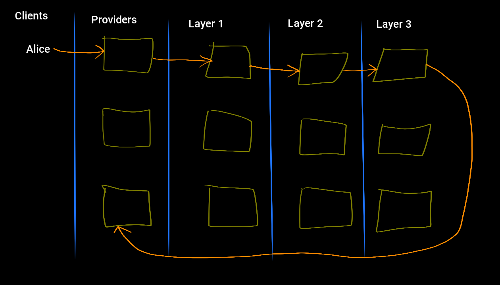
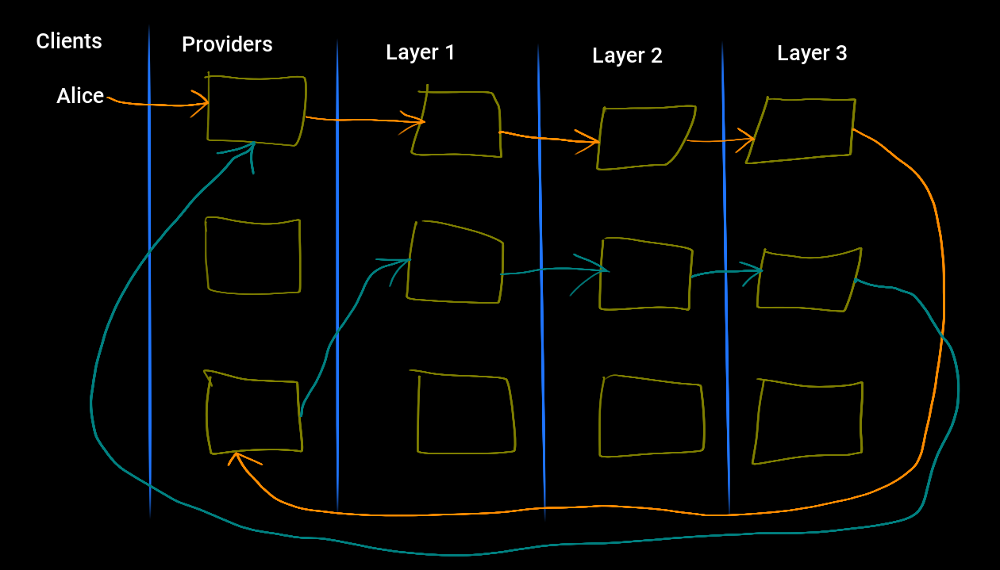

Katzenpost Mix Network Decoy Traffic Specification
**************************************************

| David Stainton

Version 0

.. rubric:: Abstract

This document describes the various types of decoy traffic designs
based on the [LOOPIX]_ paper.

.. contents:: :local:

1. Introduction
===============

To a passive network observer or a component mix, decoy traffic is
indistinguishable from normal traffic. The [LOOPIX]_ and
[ANONTRILEMMA]_ papers describes a trade off between latency and decoy
traffic. That is to say, decoy traffic adds entropy to component mixes
which means that more decoy traffic can be used such that a lower per hop
delay is used while still maintaining desired mix entropy.

Decoy traffic loops are used by mixes to detect n-1 attacks
[HEARTBEAT03]_. In this case it serves dual purposes because it is
also contributing entropy to the mixes that the loop decoy traffic
messages are routed through.

Decoy traffic also serves to provide sender and receiver
unobservability. That is, a passive network observer will not be able
to determine when a user is sending a message or receiving a message,
because observed messages are indistinguishable from decoy messages.

1.1 Conventions Used in This Document
-------------------------------------

The key words "MUST", "MUST NOT", "REQUIRED", "SHALL", "SHALL NOT",
"SHOULD", "SHOULD NOT", "RECOMMENDED", "MAY", and "OPTIONAL" in this
document are to be interpreted as described in [RFC2119]_.

1.2 Terminology
---------------

* ``decoy traffic`` - Mix network messages that add entropy and help
  defend against attacks. Also referred to as dummy traffic.

* ``message`` - A variable-length sequence of bytes sent anonymously
  through the network. Short messages are sent in a single
  packet; long messages are fragmented across multiple
  packets (see [KATZMIXE2E]_).

* ``packet`` - A Sphinx packet is a nested cryptographic packet
  which is described in [SPHINX]_ and [SPHINXSPEC]_.

1.3 Preliminary Sphinx Routing Considerations
---------------------------------------------

Section ``4.1.1 Per-hop routing information`` of the [SPHINXSPEC]_
states that the Sphinx packet header contains a vector of per-hop
routing information. Each mix in turn decrypts it's portion of this
routing information. In the case of the last hop, the Provider
decrypting this routing information should find either a
`recipient` command or a `surb_replay` command. Therefore Providers
acting as the terminating hop of a Sphinx packet are able to
distinguish the type of message being received.

2. Client SURB Loops
====================

SURB loops differ slightly from client and mix loops as described
in the [LOOPIX]_ paper; the return flight is routed by means of a
SURB. In other words, clients or mixes may form a SURB loop by sending
a message with a SURB to a Provider-side Autoresponder [KAETZCHEN]_
``loop`` service. This ``loop`` service uses the SURB to send a reply
back to the source.

In the Katzenpost mix network all Provider services respond using a
SURB and forward messages are acknowledged using a SURB. Therefore all
messages are indistinguishable from SURB loops.

Here's a diagram which shows a client sending a message through the mix
network AND in this case the destination could be a Provider service or the
spool of another user on a Provider:

This next diagram shows the reply being routed back to the client by means of
the Single Use Reply Block (see [SPHINXSPEC]_ ):

2.1 Sender Unobservability
--------------------------

Client SURB loops provide sender unobservability with respect to passive
network observers and compromised Providers. That is, if the client's Provider
is compromised, this does not give the adversary any advantage and the client's
SURB loops will be indistinguishable from normal forward traffic.

2.2 Receiver Unobservability
----------------------------

Client SURB loops provides receiver unobservability with respect to
passive network adversaries only. That is, passive network adversaries
will not be able to distinguish between SURB replies from a client
SURB loop and normal forward received messages.

However, if the client's Provider is compromised, the adversary will
be able to distinguish between the SURB reply and a received forward
message by means of the Sphinx routing commands.

3. Client Routing Loops without SURBs
=====================================

The [LOOPIX]_ paper describes routing loops which do not use SURBs.
At first glance this seems sufficient to provide clients with receiver
unobservability since the received message in indistinguishable from
receiving a normal forward message from a communication partner. However
if the client's Provider is compromised it is not sufficient.

An adversary compromising a client's Provider can count a given
client's messages sent and messages received. These two counts should
be equal if a client is themselves loops and will differ if a
communication partner sends them a message. Therefore a client SHOULD
also send drop decoy messages in order to defend against the adversary
which compromises their Provider and compares sent and received
message counts.

3.1 Sender Unobservability
--------------------------

Routing loops without SURBs are not sufficient to provide sender
unobservability with respect to a compromised client Provider.
The sent message is indistinguishable from a normal sent message,
however the response from such a loop is a normal forward message
whereas sending a normal forward message always results in a SURB reply.

4. Client Decoy Traffic Conclusions
===================================

Since it is a design goal to acheive send and receiver unobservability
with respect to compromised client Providers as well as passive
network observers, Clients must use a variety of decoy traffic types
which includes:

1. SURB Loops
2. Routing Loops without SURBs
3. Drop Decoys

This is quite different from the decoy traffic profile specified in
the [LOOPIX]_ paper because in the Katzenpost mix network we aim to
provide reliability through the use of an automatic repeat request
(ARQ) protocol scheme. An ARQ is a type of error correction protocol
which makes use of acknowledgement control messages and
retransmissions. The most notable example of a protocol making use of
an ARQ scheme is of course TCP.

5. Mix Loops For Detecting n-1 Attacks
======================================

XXX TODO: finish me.

X. Anonymity Considerations
===========================

A global adversary will be able to determine which users are online or
offline. Decoy traffic cannot guarantee prevention of long term
intersection attacks if some users go offline. [RESISTDISCLOSURE]_
Preventing long term statistical disclosure attacks depends on many
factors including the rate of mix network information leakage and the
measure of predictable and repetitive user behavior.

Y. Security Considerations
==========================

Z. Acknowledgments
==================

Appendix A. References
======================

Appendix A.1 Normative References
---------------------------------

.. [RFC2119]   Bradner, S., "Key words for use in RFCs to Indicate
               Requirement Levels", BCP 14, RFC 2119,
               DOI 10.17487/RFC2119, March 1997,
               <http://www.rfc-editor.org/info/rfc2119>.

.. [LOOPIX]    Piotrowska, A., Hayes, J., Elahi, T., Meiser, S.,
               and Danezis, G., “The Loopix Anonymity System”,
               USENIX, August, 2017
               <https://arxiv.org/pdf/1703.00536.pdf>

Appendix A.2 Informative References
-----------------------------------

.. [ANONTRILEMMA] Das, D., Meiser, S., Mohammadi, E., Kate, A.,
                  IEEE Symposium on Security and Privacy, 2018,
                  "Anonymity Trilemma: Strong Anonymity, Low Bandwidth Overhead, Low Latency—Choose Two",
                  <https://eprint.iacr.org/2017/954.pdf>.

.. [KATZMIXE2E]  Angel, Y., Danezis, G., Diaz, C., Piotrowska, A., Stainton, D.,
                "Katzenpost Mix Network End-to-end Protocol Specification", July 2017,
                <https://github.com/Katzenpost/docs/blob/master/specs/end_to_end.rst>.

.. [SPHINX]    Danezis, G., Goldberg, I., "Sphinx: A Compact and
               Provably Secure Mix Format", DOI 10.1109/SP.2009.15,
               May 2009, <http://research.microsoft.com/en-us/um/people/gdane/papers/sphinx-eprint.pdf>.

.. [SPHINXSPEC] Angel, Y., Danezis, G., Diaz, C., Piotrowska, A., Stainton, D.,
                "Sphinx Mix Network Cryptographic Packet Format Specification"
                July 2017, <https://github.com/Katzenpost/docs/blob/master/specs/sphinx.rst>.

.. [KAETZCHEN]  Angel, Y., Kaneko, K., Stainton, D.,
                "Katzenpost Provider-side Autoresponder Extension", January 2018,
                <https://github.com/Katzenpost/docs/blob/master/drafts/kaetzchen.rst>.

.. [HEARTBEAT03]  Danezis, G., Sassaman, L., "Heartbeat Traffic to Counter (n-1) Attacks",
                  Proceedings of the Workshop on Privacy in the Electronic Society, October 2003,
                  <https://www.freehaven.net/anonbib/cache/danezis:wpes2003.pdf>.

.. [TRICKLE02]  Serjantov, A., Dingledine, R., Syverson, P., "From a Trickle to
                a Flood: Active Attacks on Several Mix Types", Proceedings of
                Information Hiding Workshop, October 2002,
                <https://www.freehaven.net/anonbib/cache/trickle02.pdf>.

.. [KESDOGAN98]   Kesdogan, D., Egner, J., and Büschkes, R.,
                  "Stop-and-Go-MIXes Providing Probabilistic Anonymity in an Open System."
                  Information Hiding, 1998.

.. [POOLDUMMY]  Diaz, C., Preneel, B.,
                "Reasoning about the Anonymity Provided by Pool Mixes that Generate Dummy Traffic",
                <https://www.freehaven.net/anonbib/cache/pool-dummy04.pdf>.

.. [MIXDUMMY]  Diaz, C., Preneel, B.,
               "Taxonomy of Mixes and Dummy Traffic",
               <https://www.freehaven.net/anonbib/cache/taxonomy-dummy.pdf>.

.. [DUMMYLIMITS]  Oya, S., Troncoso, C., Pérez-González, F.
                  "Do dummies pay off? Limits of dummy traffic protection in anonymous communications",
                  <https://www.freehaven.net/anonbib/cache/pets14-dummy-traffic.pdf>.

.. [DUMMYINTERSECTION] Berthold, O., Langos, H.,
                       "Dummy Traffic Against Long Term Intersection Attacks",
                       In the Proceedings of the PETS 2002,
                       <https://www.freehaven.net/anonbib/cache/langos02.pdf>.

.. [HANGBUDDIES]  Wolinksy, D., Syta, E., Ford, B.,
                  "Hang with Your Buddies to Resist Intersection Attacks",
                  In the Proceedings of the 20th ACM conference on CCS November 2013,
                  <https://www.freehaven.net/anonbib/cache/ccs2013-buddies.pdf>.

.. [STATSDISCO]  Danezis, G., Serjantov, A.,
                 "Statistical Disclosure or Intersection Attacks on Anonymity Systems",
                 In the Proceedings of 6th Information Hiding Workshop (IH 2004), Toronto, May 2004.
                 <https://www.freehaven.net/anonbib/cache/DanSer04.ps>.

.. [RESISTDISCLOSURE]  Mathewson, N., Dingledine, R.,
                       "Practical Traffic Analysis: Extending and Resisting Statistical Disclosure",
                       <https://www.freehaven.net/anonbib/cache/e2e-traffic.pdf>.

.. [2SIDEDSDA]    Danezis, G., Diaz, C., Troncoso, C.,
                  "Two-sided Statistical Disclosure Attack",
                  In the Proceedings of the PETS 2007,
                  <https://www.freehaven.net/anonbib/cache/danezis-pet2007.pdf>.

.. [PERFECTMATCHING]  Troncoso, C., Gierlichs, B., Preneel, B., Verbauwhede, I.,
                      "Perfect Matching Disclosure Attacks",
                      In the Proceedings of the PETS 2008,
                      <https://www.freehaven.net/anonbib/cache/troncoso-pet2008.pdf>.

.. [LEASTSQUARESSDA] Perez-Gonzalez, F., Troncoso, C.,
                     "Understanding Statistical Disclosure: A Least Squares approach",
                     In the Proceedings of the PETS 2012,
                     <https://www.freehaven.net/anonbib/cache/leastsquares-pets12.pdf>.

.. [LEASTSQUARESSDA2] Perez-Gonzalez, F., Troncoso, C.,
                      "A Least Squares Approach to the Static Traffic Analysis of High-Latency
                      Anonymous Communication Systems",
                      <https://software.imdea.org/~carmela.troncoso/papers/PerezGonzalezTIFS14.pdf>.

.. [HITTINGSET]   Kesdogan, D., Pimenidis, L.,
                  "The Hitting Set Attack on Anonymity Protocols",
                  In the Proceedings of 6th Information Hiding Workshop (IH 2004), Toronto, May 2004,
                  <https://www.freehaven.net/anonbib/cache/hitting-set04.pdf>.

.. [SDA] Danezis, G.,
         "Statistical Disclosure Attacks: Traffic Confirmation in Open Environments",
         In the Proceedings of Security and Privacy in the Age of Uncertainty, May 2003,
         <https://www.freehaven.net/anonbib/cache/statistical-disclosure.pdf>.

.. [ANONLIMITS]   Kedogan, D., Agrawal, D., Penz, S.,
                  "Limits of Anonymity in Open Environments",
                  In the Proceedings of Information Hiding Workshop, October 2002,
                  <https://www.freehaven.net/anonbib/cache/limits-open.pdf>.
