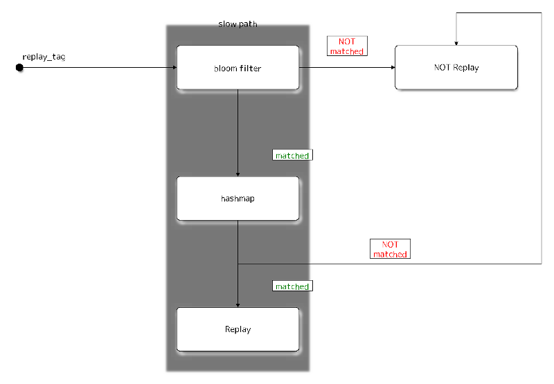

Sphinx Packet Replay Detection Specification
********************************************

| David Stainton

.. rubric:: Abstract

This document defines the Sphinx cryptographic packet replay detection
for decryption mix networks. This document is meant to serve as an
implementation guide.

.. contents:: :local:

1. Introduction
===============

The Sphinx cryptographic packet format is a compact and provably
secure design introduced by George Danezis and Ian Goldberg [SPHINX09]_.
Although it supports replay detection, the exact mechanism of reply
detection is neither described in [SPHINX09]_ nor is it described
in our [SPHINXSPEC]_. Therefore we shall describe in detail how to
efficiently detect Sphinx packet replay attacks.

1.1 Terminology
---------------

* ``Packet`` - A fixed-length sequence of octets transmitted anonymously
  through the network, containing the encrypted message and metadata
  for routing.

* ``Header`` - The packet header consisting of several components, which
  convey the information necessary to verify packet integrity and
  correctly process the packet.

* ``Payload`` - The fixed-length portion of a packet containing an
  encrypted message or part of a message, to be delivered
  anonymously.

* ``Group`` - A finite set of elements and a binary operation that
  satisfy the properties of closure, associativity, invertability,
  and the presence of an identity element.

* ``Group element`` - An individual element of the group.

* ``Group generator`` - A group element capable of generating any other
  element of the group, via repeated applications of the generator
  and the group operation.

1.2 Conventions Used in This Document
-------------------------------------

The key words "MUST", "MUST NOT", "REQUIRED", "SHALL", "SHALL NOT",
"SHOULD", "SHOULD NOT", "RECOMMENDED", "MAY", and "OPTIONAL" in this
document are to be interpreted as described in [RFC2119]_.

2. Sphinx Cryptographic Primitives and Parameters
=================================================

This specification borrows the following cryptographic primitives
and parameter constants from our [SPHINXSPEC]_:

* ``H(M)`` - A cryptographic hash function which takes an octet array M
  to produce a digest consisting of a ``HASH_LENGTH`` byte octet
  array. ``H(M)`` MUST be pre-image and collision resistant.

* ``EXP(X, Y)`` - An exponentiation function which takes the
  ``GROUP_ELEMENT_LENGTH`` byte octet array group elements ``X`` and ``Y``,
  and returns ``X ^^ Y`` as a ``GROUP_ELEMENT_LENGTH`` byte octet array.

  Let ``G`` denote the generator of the group, and ``EXP_KEYGEN()``
  return a ``GROUP_ELEMENT_LENGTH`` byte octet array group element
  usable as private key.

  The group defined by ``G`` and ``EXP(X, Y)`` MUST satisfy the Decision
  Diffie-Hellman problem.
  
3. System Overview
==================

Mixes will need to have two modes of operation:

1. Sphinx routing keys and replay caches are persisted to disk
2. Sphinx routing keys and replay caches are persisted to memory

As we shall soon see, these two modes of operation fundamentally
represent a tradeoff between mix server availability and notional
compulsion attack resistance. Ultimately it will be the mix operator's
decision to make since they affect the security and availability of
their mix servers. In particular since mix networks are vulnerable to
the various types of compulsion attacks (see [SPHINXSPEC]_ section 9.4
Compulsion Threat Considerations) it is desirable to NOT persist the
Sphinx routing keys to disk. If the mix server is seized by an
adverary then it is desirable to simply poweroff the mix server before
seizure rather than physically destroy the disk in order to prevent
capture of the Sphinx routing keys.

On the other hand, persisting Sphinx routing keys and replay caches to
disk is useful because it allows mix operators to shutdown their mix
server for maintenance purposes without loosing these Sphinx routing
keys and replay caches. This means that as soon as the maintenance
operation is completed the mix server is able to rejoin the
network. Our current PKI system [KATZMIXPKI]_ does NOT provide a
mechanism to notify Directory Authorities of such an outage or
maintenance period. Therefore if there is loss of Sphinx routing keys
this results in a mix outage until the next epoch.

3.1 Sphinx Replay Tags
----------------------

The follow excerpt from our [SPHINXSPEC]_ shows how the replay tag
is calculated.

    .. code::

        hdr = sphinx_packet.header
        shared_secret = EXP( hdr.group_element, private_routing_key )
        replay_tag = H( shared_secret )

3.2 Sphinx Replay Tag Caching
-----------------------------

It would be sufficient to use a key value store or hashmap to detect
the presence of a duplicate replay tag however we additionaly employ a
bloom filter to increase performance. We do not require any kind of
double bloom filter system simply because Sphinx keys must
periodically be rotated and destroyed to mitigate compulsion attacks
and therefore our replay caches must likewise be rotated.  This kind
of key erasure scheme limits the window of time that an adversary can
perform a compulsion attack. See our PKI specification [KATZMIXPKI]_
for more details regarding epoch key rotation and the grace period before
and after the epoch boundary.

We tune our bloom filter for line-speed; that is to say the bloom filter
is tuned for the maximum number of Sphinx packets that can be sent on the wire.
This of course has to take into account the size of the Sphinx packets as well
as the maximum line speed of the network interface. This is a conservative
tuning heuristic given that there must be more than this maximum number of
Sphinx packets in order for the

Our bloomfilter with hashmap replay detection cache looks like this:

Note that this diagram does NOT express the full complexity of the
replay caching system. In particular it does not describe how entries
are entered into the bloom filter and hashmap. Upon either bloom
filter mismatch or hashmap mismatch both data structures must be locked
and the replay tag inserted into each.

For the disk persistence mode of operation the hashmap can simply be replaced
with an efficient key value store. Efficient persistent stores may use
a write back cache and other techniques for efficiency.

3.3 Shadow Memory In Support of SEDA
------------------------------------

The best way to implement a software based router is with a
SEDA [SEDA]_ computational pipeline. We therefore need a mechanism
to allow multiple threads to reference our replay caches. Here we
shall describe a shadow memory data structure which the individual
worker threads shall use to reference the Sphinx routing keys and
replay caches.

Appendix A. References
======================

Appendix A.1 Normative References
---------------------------------

.. [RFC2119]  Bradner, S., "Key words for use in RFCs to Indicate
              Requirement Levels", BCP 14, RFC 2119,
              DOI 10.17487/RFC2119, March 1997,
              <http://www.rfc-editor.org/info/rfc2119>.

.. [SPHINXSPEC] Angel, Y., Danezis, G., Diaz, C., Piotrowska, A., Stainton, D.,
                "Sphinx Mix Network Cryptographic Packet Format Specification"
                July 2017, <https://github.com/katzenpost/docs/blob/master/specs/sphinx.rst>.

.. [KATZMIXPKI]  Angel, Y., Piotrowska, A., Stainton, D.,
                 "Katzenpost Mix Network Public Key Infrastructure Specification", December 2017,
                 <https://github.com/katzenpost/docs/blob/master/specs/pki.rst>.

.. [SEDA] Welsh, M., Culler, D., Brewer, E.,
          "SEDA: An Architecture for Well-Conditioned, Scalable Internet Services",
          ACM Symposium on Operating Systems Principles, 2001,
          <http://www.sosp.org/2001/papers/welsh.pdf>.

Appendix A.2 Informative References
-----------------------------------

.. [SPHINX09]  Danezis, G., Goldberg, I., "Sphinx: A Compact and
               Provably Secure Mix Format", DOI 10.1109/SP.2009.15,
               May 2009, <https://cypherpunks.ca/~iang/pubs/Sphinx_Oakland09.pdf>.

.. [COMPULS05] Danezis, G., Clulow, J., "Compulsion Resistant Anonymous Communications",
               Proceedings of Information Hiding Workshop, June 2005,
               <https://www.freehaven.net/anonbib/cache/ih05-danezisclulow.pdf>.
