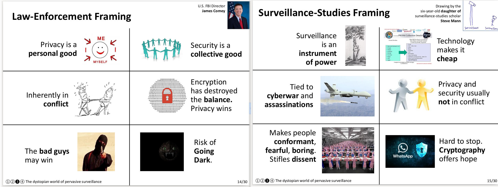

The Moral Character of Cryptographic Work
*****************************************

Phillip Rogaway

December 2015

Abstract: "Cryptography rearranges power: it configures who can do what, from what. This makes cryptography an inherently political tool, and it confers on the field an intrinsically moral dimension. The Snowden revelations motivate a reassessment of the political and moral positioning of cryptography. They lead one to ask if our inability to effectively address mass surveillance constitutes a failure of our field. I believe that it does. I call for a community-wide effort to develop more effective means to resist mass surveillance. I plead for a reinvention of our disciplinary culture to attend not only to puzzles and math, but, also, to the societal implications of our work."

http://web.cs.ucdavis.edu/~rogaway/papers/moral.html
\

https://www.usenix.org/conference/usenixsecurity16/technical-sessions/presentation/rogaway

Selected Quotes
===============

"Still more ostensibly political is `David Chaum <https://en.wikipedia.org/wiki/David_Chaum>`_’s
body of scientific work, which thoroughly embeds concerns for democracy and individual autonomy.
`Chaum’s 1981 paper "Untraceable Electronic Mail, Return Addresses, and
Digital Pseudonyms" <https://bib.mixnetworks.org/#chaum-mix>`_, suggests that a crucial privacy goal when
sending an email is to hide who is communicating with whom. The metadata, in
modern political parlance. The author offered mix nets for a solution."

"An especially problematic excision of the political is the marginalization
within the cryptographic community of the secure-messaging problem, an
instance of which was the problem addressed by Chaum. Secure-messaging
is the most fundamental privacy problem in cryptography: how can parties
communicate in such a way that nobody knows who said what. More than a
decade after the problem was introduced, `Rackoff and Simon <http://sci-hub.tw/10.1145/167088.167260>`_ would comment on
the near-absence of attention being paid to it."

"Another 20-plus years later,
the situation is this: there is now a mountain of work on secure-messaging, but
it’s unclear what most of it actually does. A recent `systemization-of-knowledge
article <https://ieeexplore.ieee.org/document/7163029>`_ paints a picture of a cryptographic task enjoying a flourishing of ad hoc
solutions, but little of it arising from the cryptographic community, as narrowly
construed, or tied to much theory. While one could certainly claim that this is
true for almost all practical security goals that employ cryptography, I think the
case is different for secure-messaging: here the work feels almost intentionally
pushed aside."

"Consider the following way to [frame mass surveillance], which follows
often-heard thoughts from cypherpunks and surveillance studies.

1. Surveillance is an instrument of power. It is part of an apparatus of
control. Power need not be in-your-face to be effective: subtle, psychological,
nearly invisible methods can actually be more effective.

2. While surveillance is nothing new, technological changes have given governments and corporations an unprecedented capacity to monitor everyone’s
communication and movement. Surveilling everyone has became cheaper
than figuring out whom to surveil, and the `marginal cost is now tiny <https://www.yalelawjournal.org/forum/tiny-constables-and-the-cost-of-surveillance-making-cents-out-of-united-states-v-jones>`_. The
Internet, once seen by many as a tool for emancipation, is being transformed
into the most dangerous facilitator for totalitarianism ever seen. Governmental surveillance is strongly linked to cyberwar. Security vulnerabilities that enable one enable the other. And, at least in the USA, the
same individuals and agencies handle both jobs. Surveillance is also strongly
linked to conventional warfare. `As Gen. Michael Hayden has explained, “we
kill people based on metadata.” <https://www.youtube.com/watch?v=kV2HDM86XgI>`_ Surveillance and assassination by drones are one technological ecosystem.

4. The law-enforcement narrative is wrong to position privacy as an individual
good when it is, just as much, a social good. It is equally wrong to regard
privacy and security as conflicting values, as privacy enhances security as
often as it rubs against it.

5. Mass surveillance will tend to produce uniform, compliant, and shallow
people `. <https://en.wikipedia.org/wiki/The_Human_Condition_(book)>`_ It will thwart or reverse social progress. In a world of ubiquitous
monitoring, there is no space for personal exploration, and no space to
challenge social norms, either. Living in fear, there is no genuine freedom.

6. But creeping surveillance is hard to stop, because of interlocking corporate
and governmental interests. Cryptography offers at least some hope. With
it, one might carve out a space free of power’s reach."
